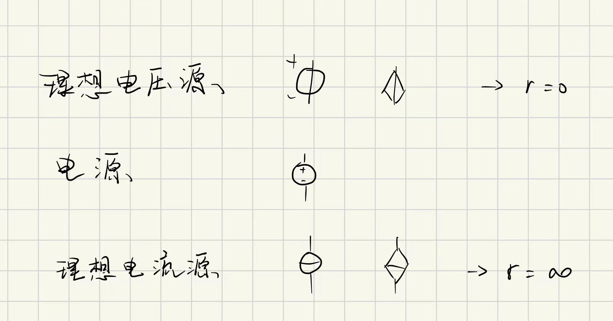
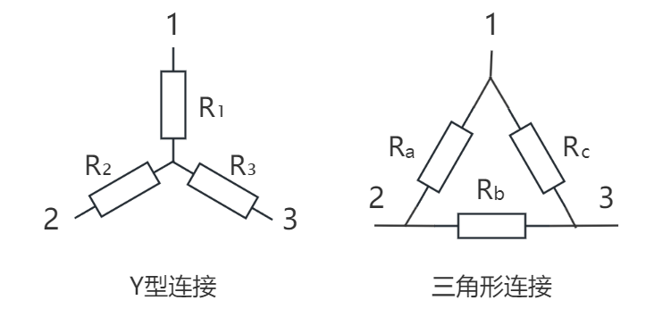
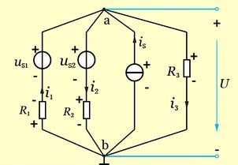

topic：电路的分析方法和电路定理
带*号为自增内容

# 电路基本概念和定律

## 基本概念

### 参考方向和参考点

人为选定

### 基本元器件

受控的电压源/电流源会标注出其受电压/电流控制的参数

理想电压源：
1. 理想电压源不能并联
2. 理想电压源和其他支路的并联等效（电压输出恒定）

理想电流源：
1. 理想电流源不能串联
2. 电流输出稳定

## 电路定律

### kirchhoff's law

1. KCL (Current)
2. KVL (Voltage)

大学物理讲过，挺好理解不多说

适用范围：https://www.zhihu.com/question/648257830

# 分析方法

## 电路等效

源于元器件的线性特征，齐次性、叠加性

电导 $G = 1/R$

### 电压源向电流源的等效

对于电压源 $U_S$ 和电阻 $R$ 的串联，其可以等效为电流源 $I_S = \frac{U_S}{R}$ 与 $R$ 的并联。

### 电阻的Y型连接和Δ型连接

推导：https://zhuanlan.zhihu.com/p/718859819

从Y到△的公式:

$R_{a}=\frac{R_{1} R_{2}+R_{2} R_{3}+R_{1} R_{3}}{R_{3}}$

$R_{b}=\frac{R_{1} R_{2}+R_{2} R_{3}+R_{1} R_{3}}{R_{1}}$

$R_{c}=\frac{R_{1} R_{2}+R_{2} R_{3}+R_{1} R_{3}}{R_{2}}$

从△到Y的公式（**常用**）:

$R_{1}=\frac{1}{R_{a}+R_{b}+R_{c}} R_{a} R_{c}$

$R_{2}=\frac{1}{R_{a}+R_{b}+R_{c}} R_{a} R_{b}$

$R_{3}=\frac{1}{R_{a}+R_{b}+R_{c}} R_{b} R_{c}$

常用公式记忆：

1. 逆时针abc、123
2. 分母是加和
3. 分子是乘积，缺少项后移错位，123对bca

## 结点电位法

弥尔曼定理（主要）和节点电位法：https://zhuanlan.zhihu.com/p/483970221

结点电压法的利用了KCL

### 弥尔曼定理*

可以认为这只是一个欧姆定律的特殊形式，用以辅助理解节点电压法

对于图中ab两点之间，选取a为参考点，参考方向a→b，每条支路分别写出欧姆定律。

KCL @ a（或者写为等式也可，此处向a为正）：

$$i_1 - i_2 + i_s - i_3 = 0$$

支路的欧姆定律（方向无所谓，可以在代入KCL时进行反转）：

$$\begin{cases}
    i_1 = \frac{u_{s1} - U}{R_1}\\
    i_2 = \frac{-u_{s2} + U}{R_2}\\
    i_3 = \frac{U}{R_3}
\end{cases}$$

代入可解得（或者将电阻的倒数写作电导）

$$U=\frac{\Sigma \frac{u_{\mathrm{Sn}}}{R_{\mathrm{n}}}+\Sigma i_{\mathrm{Sn}}}{\Sigma \frac{1}{R_{\mathrm{n}}}}$$

1. **分子项正负**：当支路上的电压源uS和电流源iS与结点电压的参考方向相反时取正号，相同时取负号；与流过该支路的电流的参考方向无关。
2. **物理意义**：分子其实就是电流源的集合， $\frac{u_{\mathrm{Sn}}}{R_{\mathrm{n}}}$ 也就是内阻为 $R_n$ ，电动势为 $u_{S_n}$ 的电压源向电流源的等效
3. **适用范围**：只适用于有两个结点的电路

### 三个以上节点电路的节点电压法

#### 线性代数和电路结构*

理解和推导：
MIT线性代数EP12图与网络：https://www.bilibili.com/video/BV1rH4y1N7BW?p=12
另一个推导：https://zhuanlan.zhihu.com/p/359111205

篇幅过长不宜在此展示 ~~实则是不会~~

#### 工程方法说明

对于有三个节点（ $n = 3$ ）的电路，设置其中一点接地，对另外两点 $a, b$ 分析，即要解如下的、含有 $n-1$ 个未知数的线性方程组：

$$\begin{cases}
    + (\sum G_{ax})U_a - (\sum G_{ab})U_b = I_{a}\\
    - (\sum G_{ba})U_a + (\sum G_{bx})U_b = I_{b}
\end{cases}$$

也可以写成 $Ax=b$ 的形式，其中 $A$ 为对称矩阵（因为两节点之间的电导计算方法相同）

1. 对角线上的元素（电导的和）为正，其他为负。
2. 右侧为流入对应节点的电流（也就是说流出为负值）
3. 总的来说可以理解为：
   1. **左侧**是由 $U_a$ 出发，所有**流出**的电流，而**右侧是流入**，是一个“流出=流入”形式的KCL
   2. 左侧的正项是在假设如果某一点（比如 $a$ ）的全部电流都流向了地面
   3. 左侧的负项则是在修正那些没有流向地面，而是流向了另一个具有不同电势的节点的电流（比如 $b$）

注意：

1. 电导求和的算法：对于正项（对角元），计入其与每个其他节点之间的电导。对于负项，只计入对应两点之间的电导（比如 $U_B$ 项的电导，只计入 $ab$ 之间的电导之和）
2. 对于存在电压源 $U_S$ 的支路，由于电压源和电阻 $R$ 的串联可以等效为电流源和电阻的并联，因此需要将电压源所产生的效应在等式右侧体现出来（也就是一个 $\frac{U_S}{R}$ 项）

## 网孔法

网孔法更加instinctive，利用了线性电路基本特性、KVL和叠加定理

### 一般情况

1. 找到电路中所有独立的单一网孔
2. 假想，每个网孔中存在对应的回路电流
3. 单个通路上的电流=所有以该通路为网孔的一边的回路电流之和

### 特殊处理（电流源）

假设电流源两端的压降为 $U$ ，也就是在静态条件下将电流源替换为电压源，而后基于电流源电流大小，增加一个与电流相关的方程

## 有受控源的电路分析

### 概念

受电压控制的|受控电压源：Votage Controlled Voltage Source, VCVS

同理有 CCVS，VCCS，CCCS

### 分析方法

通常而言，若已知受控电流源，不妨设其两端电压，而后解方程。电压源则反之。

# 电路定理

## 叠加定理

对于**线性电路**的电压和电流：

所有独立源同时作用引起的响应 = 各个独立源单独作用所引起的响应之和。

用于分析的基本流程：
1. 选定一个独立源
2. 将其他的理想电流源视作断路、理想电压源视作导线
3. 分析电路在这一情况下所需要分析的位置，电流和电压的状况

## 替代定理

解释并附三道例题：https://blog.csdn.net/modestfromhell/article/details/122441170

对于给定的任意一个电路，若某一电压为 $U_S$ 、电流为 $I_S$ ，那么这条支路就可以用一个电压等于 $U_S$ 的独立电压源，或者用一个电流为 $I_S$ 的独立电流源，或用 $R = \frac{U_S}{I_S}$ 的电阻来替代，替代后电路中全部电压和电流均保持原有值（解答唯一）。

1. 替代定理既适用于线性电路，**也适用于非线性电路**（这点是与叠加定理相差特别大的，叠加定理仅适用于线性电路）
2. 替代后电路必须有唯一解。
   1. 无电压源回路；
   2. 无电流源回路（含广义结点）。

## 戴维南定理

一个**有源线性二端网络**，可用电压源和电阻串联电路等效代换。称为戴维南定理。

计算等效电压/等效电阻的方法：
1. 断开端口，此时的电压为等效电压
2. 短接端口，此时的电流为短接电流，由短接电流求等效电阻
3. 或者类似于**叠加定理**所做，电压源→导线，电流源→断路，得到等效电阻

注意：

如果得到等效电压为0（比如说一个平衡的电桥），将这个网络视作导线

