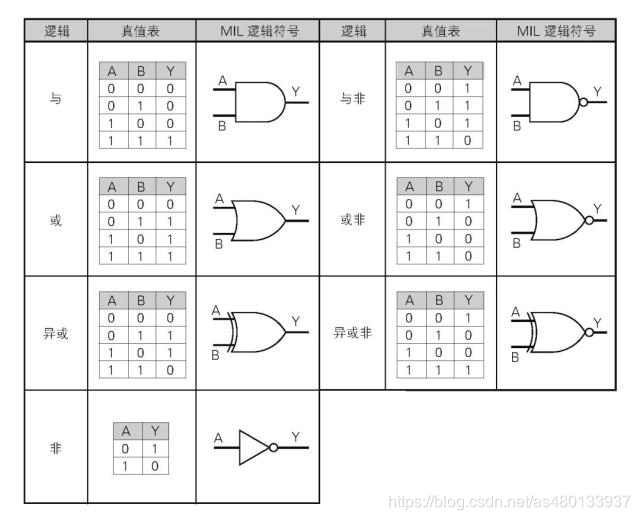
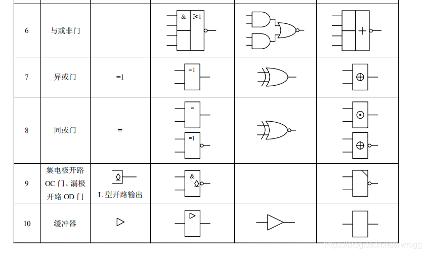
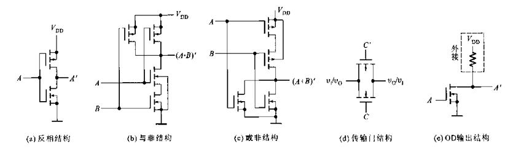

# x 逻辑运算与门电路

本节属于数电内容，结构自编，参考的主要是PPT、习题课回放以及如下的笔记链接：

1. https://zhuanlan.zhihu.com/p/7970277394
2. https://blog.csdn.net/as480133937/article/details/104554160


## x.1 逻辑运算

1 高电平 真
0 低电平 假

### x.1.1 基本运算

```
“与” 运算（AND &）：当X和Y都为真时，X & Y也为真；其他情况，X & Y 均为假。
“或” 运算 （OR |）: 当X和Y都为假时，X | Y也为假;其他情况，X | Y 均为真。
“非” 运算 （NOT ~）:当X为真时，NOT X 为假；当X为假时，~ X 为真。
“异或”运算 （XOR ^）:当X和Y都为真或都为假时，X ^ Y 为假；否则，X ^ Y 为真。
```


#### 或 OR | 逻辑加

逻辑加法

如果“A真”**或者**“B真”，那么“Y真”，否则（即AB均不为真）“Y假”

表示： $Y=A+B$

#### 与 AND & 逻辑乘

逻辑乘法

如果“A真”**而且**“B真”，那么“Y真”，否则（即AB中有一个不为真）“Y假”

表示： $Y=AB$

#### 非 NOT ~

如果“A真”则“Y假”，如果“A假”则“Y真”（**反转**）

表示： $Y=\bar A = A'$


### x.1.2 衍生运算

#### 异或 XOR ^

AB真假**不同**，则Y真，否则（AB真假相同）Y假

表示： $Y=A \oplus B=(A\bar B+\bar AB)$


#### 非运算的衍生

1. 与非 NAND
2. 或非 NOR
3. 异或非 NXOR

结果就是在各自原先的基础上加一个非门，图形上多一个非门特有的圆圈。

### x.1.4 门电路

挺好理解的



现在考试要用国标符号了




### x.1.5 真值表

非常简单，就是一张从输入到输出的对照表，蠢哭了

## x.1.6 运算法则

### 运算公式

公式（名字是自己取的）：

1. 交换律/结合律/分配律
2. $A+BC = (A+B)(A+C)$ 分配特例（重叠所导致的）
3. $A\bar A=0, A+\bar A = 1$ 互补
4. $AA=A, A+A=A$ 重叠
5. $\overline{(\bar A)} = A$ 反转
6. $A+AB=A, A(A+B)=A$ 吸收
7. $A+\bar A B = A+B$ 反吸收
8. $\overline{(AB)}=\bar A + \bar B, \overline{(A+B)}=\bar A \bar B$ 拆括号变号
9. $A \oplus B=(A\bar B+\bar AB)$ 异或定义

### 原理解释

以数学中基本的运算理解：

1. 逻辑加为什么是或——因为1+0=1，1+1=2=1。然而0+0=0
2. 逻辑乘为什么是与——因为1·0=0，只能1·1=1


## x.2 三种逻辑运算表达方式的互换

1. 表达式
2. 逻辑门电路
3. 真值表

其他的转化都非常简单直观，我们直接来看最抽象的：

### x.2.1 从真值表推电路和逻辑计算式

通常而言会给出一个拥有多个输入值的真值表，然后推导相应的门电路或者表达式

怎么做：

1. 找到真值表里面所有输出为1的组合
2. 每个组合之间用逻辑加法（OR）连接
3. 这个组合对应的逻辑表达式为：
   1. 假设有3个输入 $A_1=0, A_2=1, A_3=0$
   2. 那么为0的取反，为1的不变，用逻辑乘法连接 $\bar A_1 A_2\bar A_3$
4. 得到的就是结果

## x.3 MOSFET 构成的门电路

### x.3.1 MOSFET

~~在这一部分，你只需要知道：我们用到的都是没有预先导通的MOSFET，只有当我们能使得G、S之间的PN结（方向由箭头标出）反偏的时候，另两个极才能导通。~~

### x.3.2 识别基本功能结构

没事，这些原理都省掉，你只需要能识别：

1. 这个MOS是N沟道还是P沟道
2. 两个MOS之间的串并联关系

如下图：




其中：

1. （a）反相结构，相当于非门 - *期末第十题考这个*
2. 与非和或非，同型的两个MOS之间必然是一对串联，另一对并联
   1. （b）与非结构，其中的N沟道MOS（箭头向内的）之间是串联，那么这就是一个与非结构
   2. （c）或非结构，其中的N-MOS并联，那么这就是一个或非结构
3. （d）传输门，高/低电平信号可以从左往右传，也可从右往左传
4. （e）OD输出结构就是一个非门，但是要和其他四个结构搭配使用


### x.3.3 推导

看来还是要知道 x.3.1 的内容，简而言之，使得箭头反偏就导通

以与非结构为例


$$\begin{cases}
~
\begin{cases}
   V_A=0 & T_1\text{ 导通，} T_2 \text{ 截止}\\
   V_B=0 & T_3\text{ 导通，} T_4 \text{ 截止}\\
\end{cases} \Rightarrow Y=1 \text{（因为13都导通）}\\
~
\begin{cases}
   V_A=1 & T_1\text{ 截止，} T_2 \text{ 导通}\\
   V_B=0 & T_3\text{ 导通，} T_4 \text{ 截止}\\
\end{cases} \Rightarrow Y=1 \text{（因为3导通）}\\
~
\begin{cases}
   V_A=0 & T_1\text{ 导通，} T_2 \text{ 截止}\\
   V_B=1 & T_3\text{ 截止，} T_4 \text{ 导通}\\
\end{cases} \Rightarrow Y=1 \text{（因为1导通）}\\
~
\begin{cases}
   V_A=1 & T_1\text{ 截止，} T_2 \text{ 导通}\\
   V_B=1 & T_3\text{ 截止，} T_4 \text{ 导通}\\
\end{cases} \Rightarrow Y=0 \\
\text{（因为13都截止，24导通接地）}
~   
\end{cases}$$


| A | B | Y |
|---|---|---|
| 0 | 0 | 1 |
| 1 | 0 | 1 |
| 0 | 1 | 1 |
| 1 | 1 | 0 |

因此这是一个 $(AB)'$，与非。或非就不做推导了。

电路中的串并联关系也就显得很自然了——串联像与门，并联像或门

懂了原理之后再来判断与非和或非的方法：

——“如果AB之中，其中一个是1”


# 期末重点

1. 波特图
2. 四个负反馈都会考
3. 加法/积分
4. 比较器