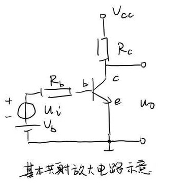
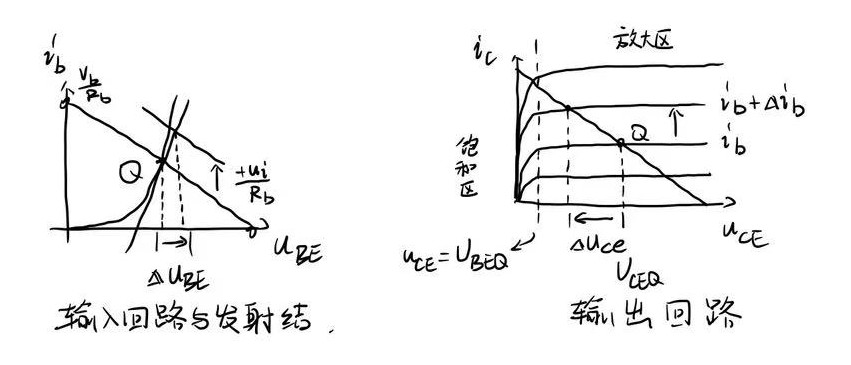
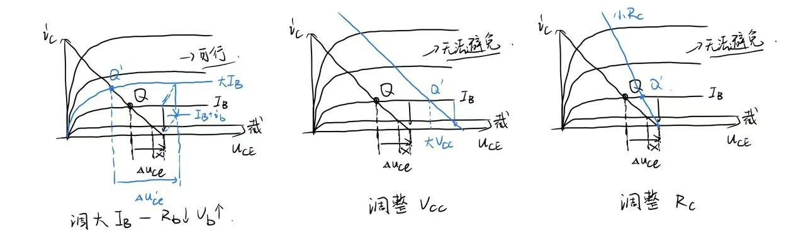
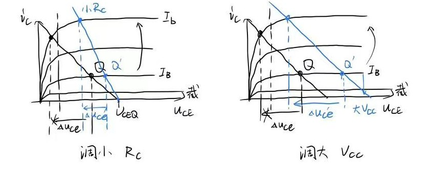

# 20251021 作业

## Q1

**作共射放大电路的信号波形映射推导，并根据输入和输出回路方程解释其波形变化的原因。**

以NPN型管为例：

{:height="200px", width="200px"}

#### 确定Q点

输入回路

$$I_\mathrm{BQ} = \frac{V_\mathrm b - V_\mathrm{BEQ}}{R_\mathrm b}$$

输出回路

$$U_\mathrm{CEQ} = V_\mathrm{CC} - I_\mathrm{CQ}R_\mathrm{C}$$

#### 画图

画出输入回路负载线，使其与发射结的伏安特性曲线（ $u_\mathrm{BE}$ - $i_\mathrm{b}$ ）相交于静态工作点 $Q$ ，由输入回路方程，输入回路负载线为：

$$i_\mathrm{b} = -\frac{1}{R_\mathrm{b}}u_\mathrm{BE} + \frac{V_\mathrm b}{R_\mathrm{b}}$$

画出输出回路负载线，使其与三极管的工作特性曲线（ $u_\mathrm{CE}$ - $i_\mathrm{c}$ ）相交于静态工作点 $Q$ ，由输出回路方程，输出回路负载线为：

$$i_\mathrm{c} = -\frac{1}{R_\mathrm{c}}u_\mathrm{CE} + \frac{V_\mathrm {CC}}{R_\mathrm{c}}$$

#### 结论

图中的有向箭头标出了当 $V_\mathrm{b}$ 增加一个正向的 $u_\mathrm{i}$ 时，图形的变化。可以看到，当增加一个 $u_\mathrm{i}$ 时，输出成比例地减小一个 $\Delta u_\mathrm{ce}$ 。因此基本共射放大电路所输出的交流信号部分与输入的交流信号反相。这里可以通过对交流通路的进一步分析，来得到放大倍数等信息。

## Q2

**分析共射放大电路出现顶部失真的原因，及如何通过电路设计解决。**

顶部失真即输出的峰值被削，对应了三极管进入截止状态

从图中可以看出，在 $u_\mathrm{i}$ 不变的前提下：

图形上：将交点 $Q$ 的位置“抬高”使得 $i_\mathrm{b}$ 变小时不进入截止区

物理意义：大 $I_\mathrm{B}$ 确保三极管不会截止 / 大 $V_\mathrm{b}$ 小 $R_\mathrm{b}$

## Q3

**分析共射放大电路出现底部失真的原因，及如何通过电路设计解决。**

底部失真即输出的谷值被削，对应了三极管进入饱和状态

从图中可以看出， $Q$ 离截止区越近，离饱和区越远。因此，根据之前的分析，可以通过减小 $V_\mathrm{b}$ 增大 $R_\mathrm{b}$ 解决饱和失真。

又或者，调整使得 $V_\mathrm{CC}\uparrow$ $R_\mathrm{c}\downarrow$ ，增加施加在三极管上的功率，使得 $Q$ 点向右移出饱和区。