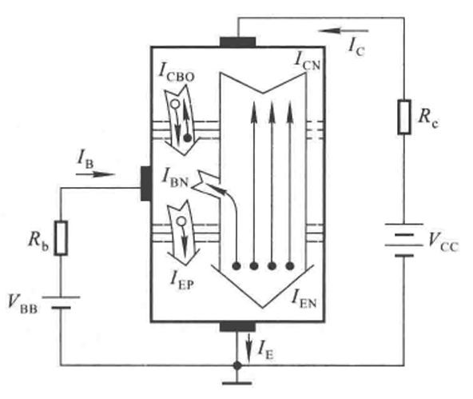
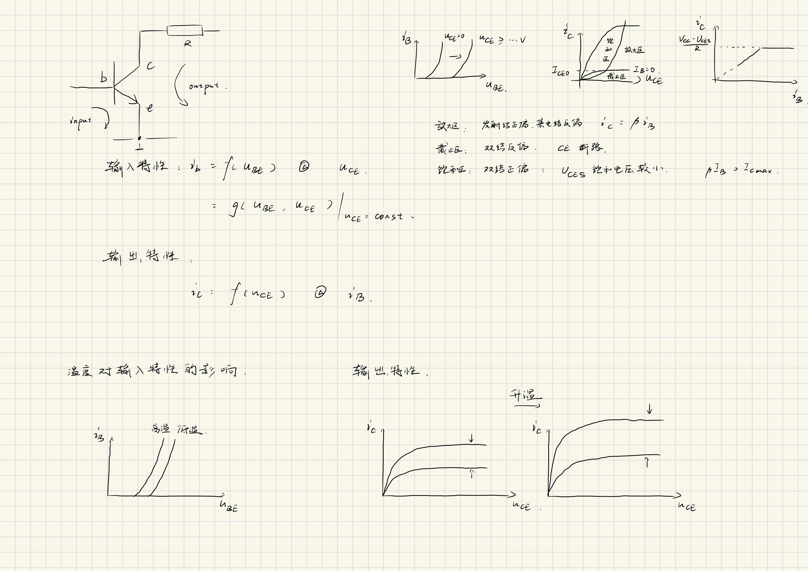
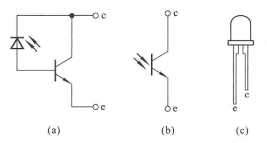
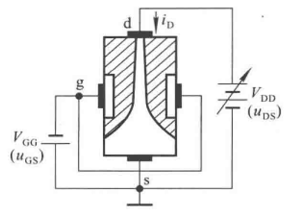
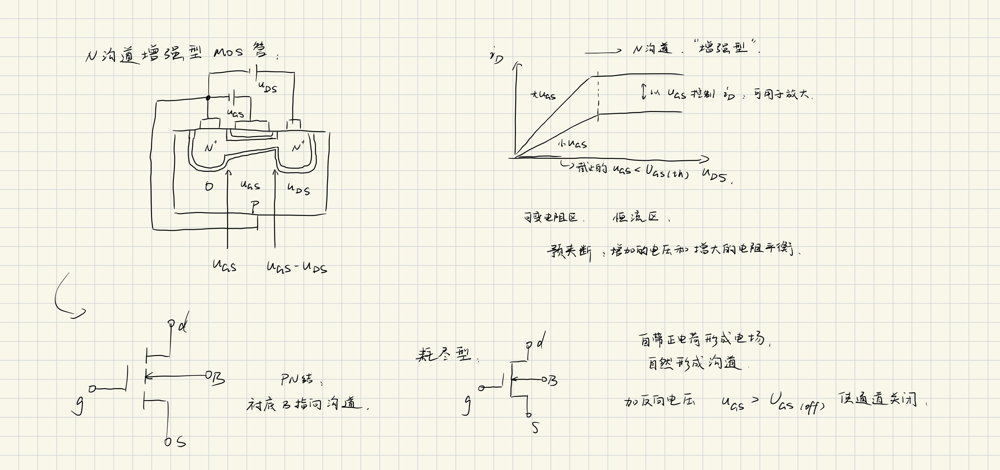
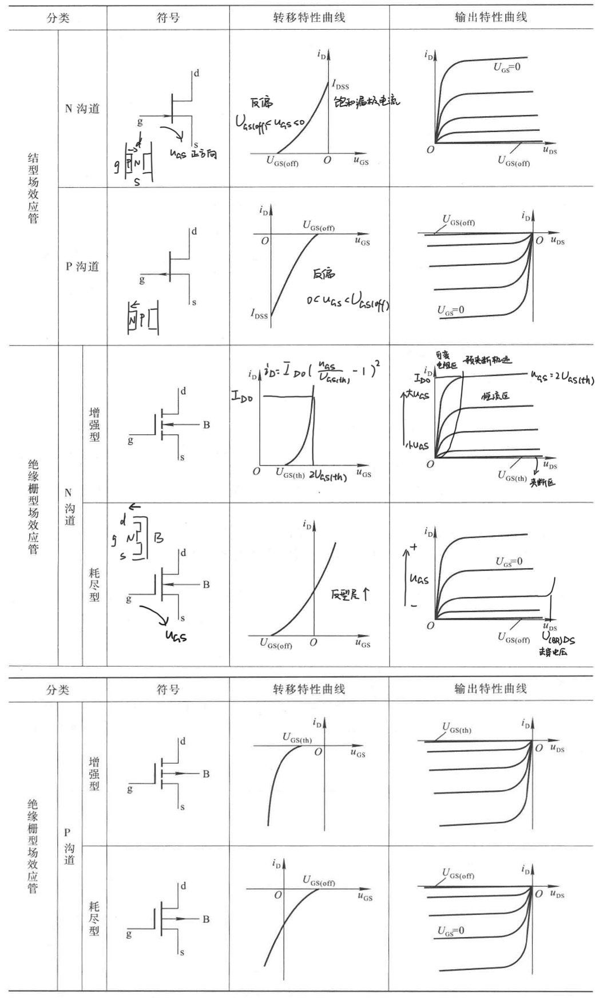

# 1 (1.3-1.4)

## 1.3 晶体三极管

### 1.3.1 结构与类型

双极晶体管(Biopolar Junction Transistor, BJT)，三极管

三个极

- **发射级**e，Emitter
- **基极**b，Base
- **集电极**c，Collector

两个结

- 发射结
- 集电结

特点：

- 发射区发射载流子、掺杂浓度高
- 集电区收集载流子、掺杂浓度低、面积大
- 基区薄，扩散、复合、产生

箭头标出**发射结**导通的方向

NPN，P→N指向外侧
PNP，N←P指向内侧

#### 三极管的工作状态

1. 放大状态：发射结正偏，使得载流子从发射区涌向基区，集电结反偏，集电结的内电场大，将载流子迅速拉入集电区
2. 截止状态：均反偏，全部断开
3. 饱和状态：均正偏，全部连接（受到 $V_\mathrm{ce}$ 的限制）

参见 1.3.3 特性曲线

### 1.3.2 放大作用

#### 基本共射放大电路

三极管的正偏：发射结正偏

#### 晶体管内部载流子的运动

E=Emitter，B=Base，C=Collector，N=Negative，P=Positive，O=Open

$I_\mathrm E$下的电流：
- $I_\mathrm{EN}$，发射区向基区扩散的电子电流
- $I_\mathrm{EP}$，基区向发射区扩散的空穴电流

$I_\mathrm B$下的电流：
- $I_\mathrm{BN}$，基区内电子复合形成的电流

$I_\mathrm C$下的电流：
- $I_\mathrm{CN}$，基区内非平衡少子向收集区扩散的电子电流
- $I_\mathrm{CBO}$，（发射极开路时）基区与集电区平衡少子的漂移电流（集电结的反向饱和电流）
- $I_\mathrm{CEO}$，基极开路（ $I_\mathrm B = 0$ ）时，由 $V_\mathrm{CC}$ 驱动的、ce极间的电流

对于一个三极管， $I_\mathrm{CBO}$ 和 $I_\mathrm{CEO}$ 在一定的温度范围内视为不变
发射极开路 $I_\mathrm{CBO}$ 定义了“集电结本身有多漏”，而基极开路 $I_\mathrm{CEO}$ 定义了“整个晶体管在截止时有多漏”。

由此可见：

$$\begin{aligned}
I_{\mathrm{E}}&=I_{\mathrm{EN}}+I_{\mathrm{EP}}=I_{\mathrm{CN}}+I_{\mathrm{BN}}+I_{\mathrm{EP}} \\
I_{\mathrm{C}}&=I_{\mathrm{CN}}+I_{\mathrm{CBO}} \\
I_{\mathrm{B}}&=I_{\mathrm{BN}}+I_{\mathrm{EP}}-I_{\mathrm{CBO}}\\
&=I_{\mathrm{B}}^{\prime}-I_{\mathrm{CBO}}\end{aligned}$$

从外部看：

$$ I_{\mathrm{E}}=I_{\mathrm{C}} + I_{\mathrm{B}} $$

#### 共射放大系数

共射即共用发射级

1. **共射直流放大系数**：
   发射区发射的载流子中，能够被集电区有效收集的载流子数目与在基区复合导致基极电流产生的载流子数目之比

   当基极开路时，集电区和发射区之间的总电流 $I_\mathrm{CEO}$ 不仅包括集电结的反向饱和电流 $I_\mathrm{CBO}$ ，还包括由于基区少数载流子的扩散和复合所引起的额外电流。这部分额外电流与 $\bar \beta$ 成正比。

$$\overline \beta 
= \frac {I_\mathrm{CN}} {I_\mathrm B ^\prime}
= \frac{I_\mathrm C - I_\mathrm{CBO}}{I_\mathrm B + I_\mathrm{CBO}}$$

2. **共射交流放大系数**：

$$\beta = \Delta i_\mathrm C / \Delta i_\mathrm B$$

交流前提下：

$$\begin{aligned}
i_{\mathrm{C}}
&= I_{\mathrm{c}} + \Delta i_{\mathrm{C}} \\
&= \bar{\beta} I_{\mathrm{B}} + I_{\mathrm{CEO}} + \beta \Delta i_{\mathrm{B}} \\
&\approx \bar{I}_{\mathrm{B}}+\beta \Delta i_{\mathrm{B}}
\end{aligned}$$

#### 共基放大系数

共基即共用基极

1. **共基直流放大系数**

$$\overline \alpha 
= \frac{I_\mathrm{CN}}{I_\mathrm E}
\approx \frac{I_\mathrm C}{I_\mathrm E} $$

对精确值展开：

$$I_\mathrm C = \overline \alpha I_\mathrm E + I_\mathrm{CBO}$$

由总电流关系，整理得：

$$\overline \alpha = \frac{\overline \beta}{1 + \overline \beta}$$

2. **共基交流放大系数**

同样根据总电流的关系：

$$\alpha = \Delta i_\mathrm C/ \Delta i_\mathrm E = \frac{\beta}{1 + \beta}$$

通常 $\beta \ll 1,~ \alpha \approx 1;~ \overline \beta = \beta,~ \overline \alpha = \alpha$

### 1.3.3 晶体管的共射特性曲线

#### 输入特性

#### 输出特性

### 1.3.4 晶体管的主要参数*

#### 直流参数

（工程计算上只需要最后那个约等于）

1. 共射直流放大系数
 
   $\overline \beta = \frac{I_\mathrm C - I_\mathrm{CBO}}{I_\mathrm B + I_\mathrm{CBO}} = \frac{I_\mathrm C - I_\mathrm{CEO}}{I_\mathrm B} \approx \frac{I_\mathrm C}{I_\mathrm B}$

2. 共基直流电流放大系数 

   $\overline \alpha = \frac{I_\mathrm{CN}}{I_\mathrm E} = \frac{\overline \beta}{1+\overline \beta} \approx \frac{I_\mathrm C}{I_\mathrm E}$

3. 极间反向电流 

   $I_\mathrm{CBO},~ I_\mathrm{CEO}=(1+\overline\beta)I_\mathrm{CBO}$

#### 交流参数

1. 共射交流放大系数 

   $\beta = \left.\frac{\Delta i_{C}}{\Delta i_{B}}\right|_{U_\mathrm{CE}=\mathrm{const.}} \approx \overline \beta$

2. 共基交流放大系数

   $\alpha = \left.\frac{\Delta i_{C}}{\Delta i_{E}}\right|_{U_\mathrm{CB}=\mathrm{const.}} \approx \overline \alpha$

3. 特征频率

   频率过高使得 $I_\mathrm C / I_\mathrm B \downarrow$ 并发生相移， $f_\mathrm T$ 时 $\beta \to 1^+$

#### 极限参数

1. 最大集电极耗散功率 $P_\mathrm{CM}$

   即受散热影响的功率上限

2. 最大集电极电流 $I_\mathrm{CM}$

   即无法无限放大，且受到功率限制

3. 极间反向击穿电压 $U_\mathrm{(BR)XYO}$

   即当Z开路时，XY间能承受的最大反向电压

   $U_\mathrm{(BR)CBO}, U_\mathrm{(BR)CEO}$ 对应集电结所允许加的最高反向电压。

   $U_\mathrm{(BR)EBO}$ 对应发射结所允许加的最高反向电压。

### 1.3.5 温度对晶体管参数的影响*

#### 锗管和硅管

| 特性对比 | 锗管 | 硅管 |
| --- | --- | --- |
| 导通电压 (VBE) | 低 (约0.1V - 0.3V) | 高 (约0.5V - 0.7V) |
| 反向饱和电流 (ICBO) | 大 | 非常小 |
| 温度稳定性 | 差 | 好 |
| 允许工作温度 | 较低 (约70-85℃) | 较高 (约150-200℃) |
| 生产成本 | 较高 (已不规模生产) | 极低 (工业化成熟) |
| 应用领域 | 基本被淘汰，见于老式收音机等 | 绝对主流，几乎所有现代电子设备 |

### 1.3.6 光电三极管*

## 1.4 场效应管

Field Effect Transistor, FET

场：电场→用于控制的电流小，只有多子导电，受温度影响小

### 1.4.1 结型场效应管

Junction FET, JFET

类似于耗尽型MOSFET，区别则是JFET只能加反向电压保证耗尽层的存在，不允许PN结正向导通。

### 1.4.2 绝缘栅型场效应管

Insulated Gate FET, IGFET

(金属氧化物半导体)场效应晶体管，(MOS)FET

#### N沟道增强型MOS管 

enhancement type

1. 结构与符号
   - 栅极g，gate
   - 源极s，source
   - 漏极d，drain
2. 工作原理
   1. 当 $u_\mathrm{GS} > U_\mathrm{GS(th)}$ 时，沟道开始形成，然后对ds加 $u_\mathrm{DS}$
   2. **可变电阻区**：可变电阻区导通后的一定 $u_\mathrm{DS}$ 内，对于不变的 $u_\mathrm{GS}$ ， $i_\mathrm{DS} \propto u_\mathrm{DS}$
   3. 随着 $u_\mathrm{DS}$ 不断增大，漏极处 $u_\mathrm{GD} = u_\mathrm{GS} - u_\mathrm{DS}$ ，d侧通道口变窄
   4. **恒流区**：预夹断，此时增加的电压与增大的电阻平衡， $i_\mathrm D$ 大小取决于 $u_\mathrm{GS}$

总结：通过 $u_\mathrm{GS}$ 控制导电的N型沟道的宽窄，即用 $u_\mathrm{GS}$ 控制 $R_\mathrm{GS}$

#### N沟道耗尽型MOS管 

depletion type

通过在栅极绝缘层封入电荷，提前生成电场，加反向电压 $u_\mathrm{GS} < U_\mathrm{GS(off)}$ 可使通道关闭

#### VMOS管

优化漏极夹断区散热

### 1.4.3 场效应管的特性曲线与主要参数

#### 特性曲线

转移特性曲线 $u_\mathrm{GS}$ - $i_\mathrm D$
输出特性曲线 $u_\mathrm{DS}$ - $i_\mathrm D$

[查看未标记原图点此](fig/FET_curves.png)

#### 直流参数

1. 开启电压 $U_\mathrm{GS(th)}$

   适用于enhancement type MOSFET

2. 夹断电压 $U_\mathrm{GS(off)}$

   适用于JFET / depletion type MOSFET

3. 饱和漏极电流 $I_\mathrm{DSS}$

   JFET 在 $u_\mathrm{GS} = 0 \mathrm V$ 时预夹断的电流

4. 直流输入电阻 $R_\mathrm{GS(DC)}$

   $R_\mathrm{GS(DC)} = u_\mathrm{GS} / i_\mathrm G$
   $R_\mathrm{GS(DC), MOSFET} > 10^9 \Omega$， $R_\mathrm{GS(DC), JFET} > 10^7 \Omega$

#### 交流参数

1. 低频跨导

   $g_\mathrm m = \frac{\Delta i_\mathrm D}{\Delta u_\mathrm{GS}} |_{u_\mathrm{DS} = \mathrm{const.}}$ 单位取 $\mathrm S$ ，西门子。

2. 极间电容

   最高工作频率 $f_\mathrm M$ 综合考虑了 $C_\mathrm{gs},~ C_\mathrm{gd},~ C_\mathrm{ds}$ 三个极间电容。

#### 极限参数

1. 最大漏极电流 $I_\mathrm{DM}$
2. 击穿电压
   进入恒流区后继续加大电压，漏-源击穿电压 $U_\mathrm{(BR)DS}$
   对于JFET有栅-源击穿电压 $U_\mathrm{(BR)GS}$
3. 最大耗散功率 $P_\mathrm{DM}$

### 1.4.4 场效应管与晶体管的比较*

# 推导过程

## 共射放大系数、三极管 $I_\mathrm{CEO}$ 与 $I_\mathrm{CBO}$ 的关系

### $I_\mathrm{CEO}$ 与 $I_\mathrm{CBO}$ 的关系

对$\overline \beta$表达式化简，可以得到（1）式：

$$I_\mathrm C = \overline \beta (I_\mathrm B + I_\mathrm{CBO}) + I_\mathrm{CBO}$$

根据 $I_\mathrm{CEO}$ 与 $I_\mathrm{CBO}$ 的定义，基极开路， $I_\mathrm B = 0$ 得到（2）式：

$$I_\mathrm C = \overline \beta I_\mathrm B + I_\mathrm{CEO}$$

在 $\overline \beta \gg 1,~ I_\mathrm{CEO} \ll I_\mathrm B$ 时，可以得到结论：

从（1）式到（2）式的过程中可以看出：

$$I_\mathrm{CEO} = (1 + \overline \beta) I_\mathrm{CBO}$$

### 共射直流/交流放大系数

通过直接近似（ $\overline \beta \gg 1,~ I_\mathrm{CEO} \ll I_\mathrm B$ 时）：

$$I_\mathrm C \approx \overline \beta I_\mathrm B$$

交流前提下：

$$\begin{aligned}
i_{\mathrm{C}}
&= I_{\mathrm{c}} + \Delta i_{\mathrm{C}} \\
&= \underbrace{\overline{\beta} I_{\mathrm{B}} + I_{\mathrm{CEO}}}_\text{直流分量} + \underbrace{\beta \Delta i_{\mathrm{B}}}_\text{交流分量} \\
&\approx \overline{I}_{\mathrm{B}} + \beta \Delta i_{\mathrm{B}}
\end{aligned}$$

对于工艺良好的二极管 $\beta \approx \overline{\beta}$ ，合适的条件下，这个大小可以控制在5%以内。这取决于掺杂的均匀程度、基区宽度的均匀程度。 $\overline{\beta}$ 还会有一定的温度漂移。*