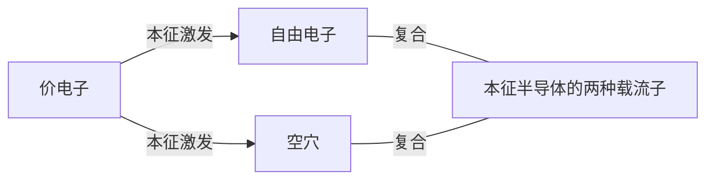
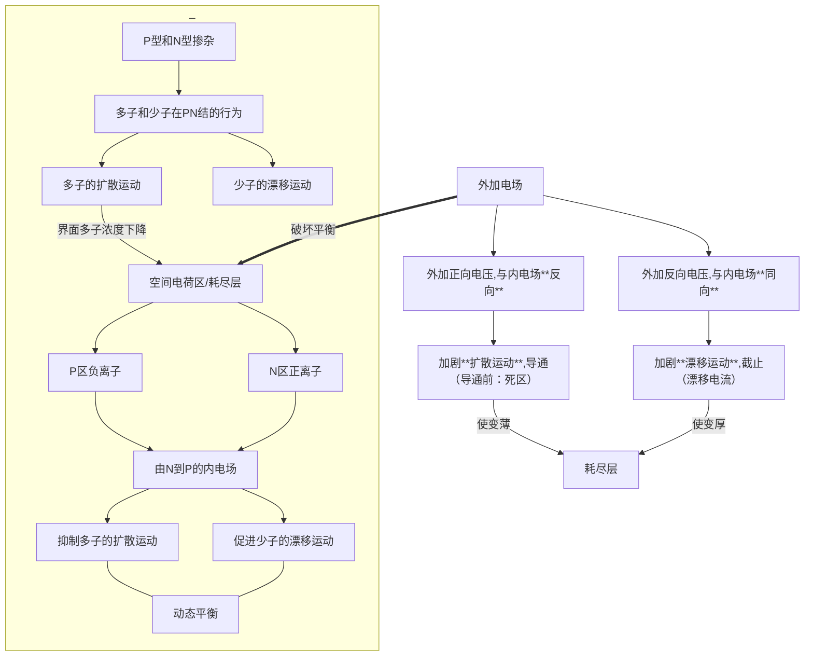
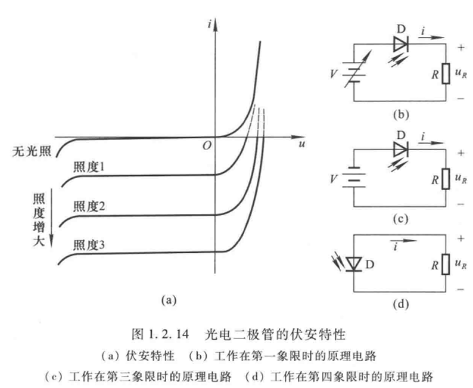
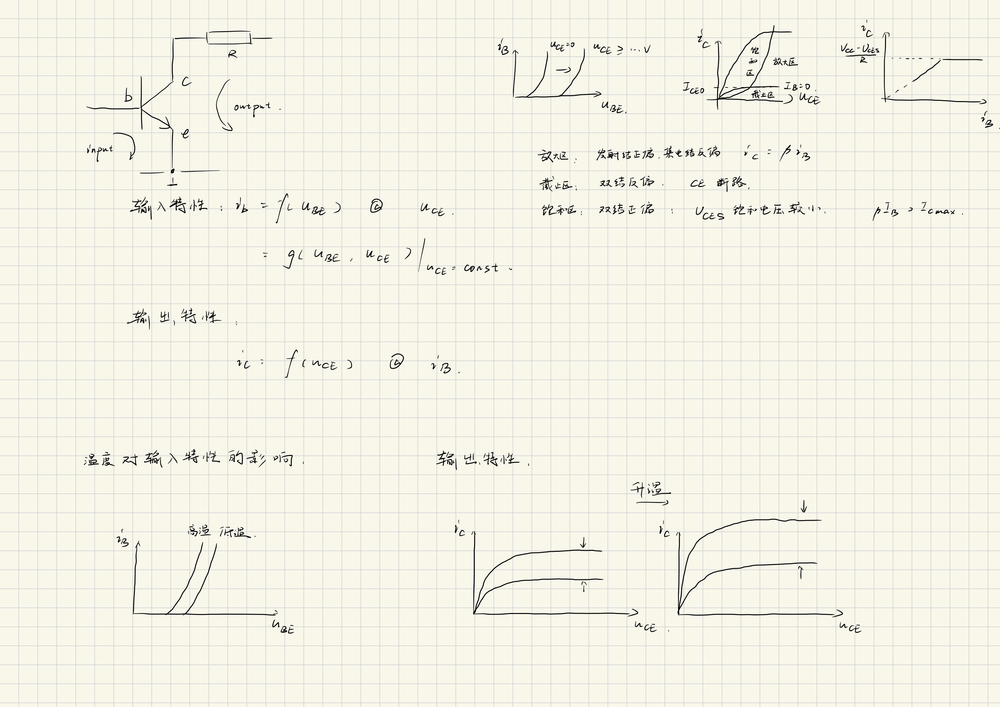
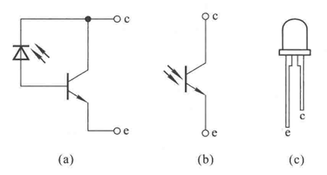
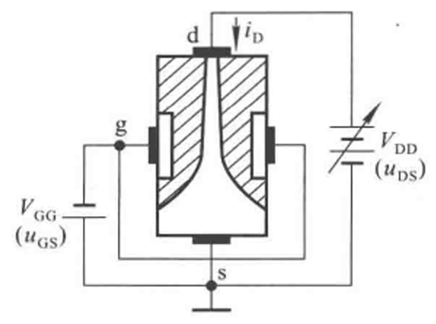
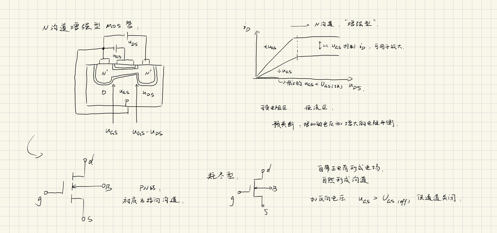
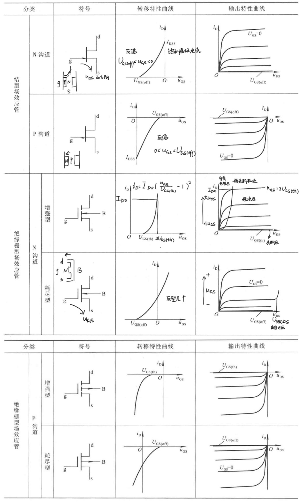

# 1 常用半导体
## 1.1 基础知识
### 1.1.1 本征半导体与其晶体结构

动态平衡
温度
载流子浓度

$$n_i = p_i = K_i T^ \frac 3 2 \mathrm e ^ \frac{-E_{CO}}{2kT}$$

### 1.1.2 杂质半导体
本征半导体中掺入少量杂质元素

**N（Negative）型半导体**
- 掺入P（+5）——成键之后，自由电子多余，多数载流子（多子），空穴是少数载流子（少子）
- 外界条件（温度）对多子的影响**小**、对少子的影响**大**（基数问题）
- P为**施主原子**

**P（Positive）型半导体**
- 掺入B（+3）——空穴多余，空穴多子，自由电子少子
- B为**受主原子**

### 1.1.3 PN结

#### 形成

**多子**由浓度差驱动的**扩散运动**
**少子**在电场力作用下的**漂移运动**

掺杂浓度的差异导致的**不对称节**/**对称节**

#### 单向导电性

- 正向电压：外加电场将载流子推过势垒（耗尽层），恢复多子的扩散运动
- 反向电压：耗尽层变厚，少子的漂移运动加强，对温度敏感
- 伏安特性曲线

#### 电流方程

$$ i = I_s(\mathrm e^{\frac{u}{U_T}} - 1)$$

- $u$外加电压，大小约为百毫伏
- $k$为**玻尔兹曼常数**
- $I_s$为**反向饱和电流**，即反向偏置下的电流，漂移电流占主导
- $300\mathrm K$下，**温度的电压当量** $ U_T = kT/q = 26 \mathrm{mV} $

#### 伏安特性

正向特性：
- **死区**
- $u \gg U_T,~ i \approx I_s \mathrm e^\frac{u}{U_T}$

反向特性：

- $u \ll U_T,~ i \approx -I_s $
- 反向击穿：共价键的破坏、电子-空穴对的大量产生
  - **雪崩击穿**：少子的漂移运动撞出价电子。掺杂浓度低，PN结宽
  - **齐纳击穿**：大场强直接破坏。掺杂浓度高，PN节窄
  - **齐纳击穿电压低**

反向击穿通常导致烧毁（二次击穿）
**高温促进齐纳击穿，抑制雪崩击穿**

#### 电容效应

1. **势垒电容**
   - 耗尽区离子电荷不可移动，可以视为电容器
   - 反向电压越大，耗尽区宽度越大，势垒电容$C_b$越小

2. **扩散电容**
   - PN结平衡状态下的少子为平衡少子
   - 扩散区内，P→N的空穴/N→P的自由电子为非平衡少子
   - 非平衡少子的浓度梯度形成扩散电容$C_d$
   - 加压，浓度梯度变陡峭
   $i \uparrow$，非平衡少子寿命 $\tau \uparrow$， $U_T \downarrow$ ， $C_d \uparrow$

3. **结电容**
   势垒电容和扩散电容分别响应电压变化，分别储存电荷，符合并联电容关系。
   因此PN结结电容： $C_i = C_b + C_d$ ，通常可能的大小在 $1\sim 100 \mathrm{pF}$

$X_C = \frac 1 {2\pi f C}$， $f\uparrow X_C\downarrow$， $C\uparrow X_C \downarrow$，二极管对**高频信号的整流作用变差**。
高频率下使用二极管相当于为结电容充放电。

## 1.2 二极管

### 1.2.1 常见结构

点接触型二极管：小结面积，小电容，小电流高频整流
面接触型二极管：大结面积，大电容，大电流低频整流
平面二极管：扩散法制成，根据结面积确定用途

### 1.2.2 伏安特性

#### 区别

- **体电阻**的存在，电流小，压降大
- 表面**漏电流**，反向电流大一些
- 温度升高使正向特性左移，反向特性下移

近似分析仍使用之前的公式

开启电压、导通电压和反向饱和电流

#### 温度的影响

下移和左移
每升高 $1^\circ C$，正向压降减小 $2\sim 2.5 \mathrm{mV}$
每升高 $10^\circ C$，反向电流增大一倍

### 1.2.3 主要参数

1. **最大整流电流** $I_\mathrm F$
   长期运行时所允许的最大电流，与结面积和散热有关
2. **最高反向工作电压** $U_\mathrm R$
   通常标记为 $U_\mathrm{(BR)}$的一半
3. **反向电流** $I_R$
   关系单向导电性
4. **最高工作频率** $f_\mathrm M$
   在最高工作频率以上，二极管单项导电性差

### 1.2.4 二极管的等效电路

——从非线性元件到线性元件

#### 伏安特性折线化

1. 理想二极管，严格单向导电
2. 开通电压：提供导通压降
3. 电阻

#### 二极管的微变等效电路

### 1.2.5 稳压二极管

#### 伏安特性

在 $U_\mathrm Z$附近，极小的电压变化→极大的电流变化

#### 主要参数

1. **稳定电压** $U_\mathrm Z$
   对于一个二极管是确定值
2. **稳定电流** $I_\mathrm Z$
   工作时的电流大于最小稳定电流
3. **额定功耗** $P_\mathrm{ZM}$
   $P_\mathrm{ZM} = U_\mathrm Z I_\mathrm Z$
4. **动态电阻** $r_\mathrm Z$
   $r_\mathrm Z = \Delta U_\mathrm Z / \Delta I_\mathrm Z$
5. **温度系数** $\alpha$
   $\alpha = \Delta U_\mathrm Z / \Delta T$
   温度升高促进低电压的齐纳击穿，因此**齐纳击穿温度系数为负**（4V以下）
   温度升高抑制高电压的雪崩击穿，因此**雪崩击穿温度系数为正**（7V以上）
   4V~7V，温度系数接近0，两种击穿均有

从计算角度理解稳压管电路：

将稳压二极管与限流电阻串联，使之在该状态下保持稳定的反向击穿，此时将稳压管看作电阻为$r_\mathrm Z$的一个小电阻。负载发生电阻的改变时，由于动态电阻较小，负载与稳压二极管整体并联的电阻变化相对限流电阻小，因此两端压降变化不明显。

### 1.2.6 其他类型二极管*

#### 发光二极管

Light Emitting Diode, LED

#### 光电二极管

Photodiode

## 1.3 晶体三极管

### 1.3.1 结构与类型

双极晶体管(Biopolar Junction Transistor, BJT)，三极管

三个极

- **发射级**e，Emitter
- **基极**b，Base
- **集电极**c，Collector

两个结

- 发射结
- 集电结

特点：

- 发射区发射载流子、掺杂浓度高
- 集电区收集载流子、掺杂浓度低、面积大
- 基区薄，扩散、复合、产生

箭头标出**发射结**导通的方向

NPN，P→N指向外侧
PNP，N←P指向内侧

### 1.3.2 放大作用

#### 基本共射放大电路

三极管的正偏：发射结正偏

#### 晶体管内部载流子的运动

E=Emitter，B=Base，C=Collector，N=Negative，P=Positive，O=Open

$I_\mathrm E$下的电流：
- $I_\mathrm{EN}$，发射区向基区扩散的电子电流
- $I_\mathrm{EP}$，基区向发射区扩散的空穴电流

$I_\mathrm B$下的电流：
- $I_\mathrm{BN}$，基区内电子复合形成的电流

$I_\mathrm C$下的电流：
- $I_\mathrm{CN}$，基区内非平衡少子向收集区扩散的电子电流
- $I_\mathrm{CBO}$，（发射极开路时）基区与集电区平衡少子的漂移电流（集电结的反向饱和电流）
- $I_\mathrm{CEO}$，基极开路（ $I_\mathrm B = 0$ ）时，由 $V_\mathrm{CC}$ 驱动的、ce极间的电流

对于一个三极管， $I_\mathrm{CBO}$ 和 $I_\mathrm{CEO}$ 在一定的温度范围内视为不变
发射极开路 $I_\mathrm{CBO}$ 定义了“集电结本身有多漏”，而基极开路 $I_\mathrm{CEO}$ 定义了“整个晶体管在截止时有多漏”。

由此可见：

$$\begin{aligned}
I_{\mathrm{E}}&=I_{\mathrm{EN}}+I_{\mathrm{EP}}=I_{\mathrm{CN}}+I_{\mathrm{BN}}+I_{\mathrm{EP}} \\
I_{\mathrm{C}}&=I_{\mathrm{CN}}+I_{\mathrm{CBO}} \\
I_{\mathrm{B}}&=I_{\mathrm{BN}}+I_{\mathrm{EP}}-I_{\mathrm{CBO}}\\
&=I_{\mathrm{B}}^{\prime}-I_{\mathrm{CBO}}\end{aligned}$$

从外部看：

$$ I_{\mathrm{E}}=I_{\mathrm{C}} + I_{\mathrm{B}} $$

#### 共射放大系数

共射即共用发射级

1. **共射直流放大系数**：
   发射区发射的载流子中，能够被集电区有效收集的载流子数目与在基区复合导致基极电流产生的载流子数目之比

$$\overline \beta 
= \frac {I_\mathrm{CN}} {I_\mathrm B ^\prime}
= \frac{I_\mathrm C - I_\mathrm{CBO}}{I_\mathrm B + I_\mathrm{CBO}}$$

2. **共射交流放大系数**：

   $$\beta = \Delta i_\mathrm C / \Delta i_\mathrm B$$

   处理如下：

   $$\begin{aligned}
   I_\mathrm C 
   &= \overline \beta (I_\mathrm B + I_\mathrm{CBO}) + I_\mathrm{CBO}
   & \text{（对$\overline \beta$表达式化简）}\\
   &= \overline \beta I_\mathrm B + I_\mathrm{CEO} 
   & \text{（令$I_\mathrm B = 0$，根据$I_\mathrm{CEO}$的定义得到）}\\
   &\approx \overline \beta I_\mathrm B
   & \text{（$\overline \beta \gg 1,~ I_\mathrm{CEO} \ll I_\mathrm B$时）}\\
   & \Longrightarrow I_\mathrm{CEO} = (1 + \overline \beta) I_\mathrm{CBO}
   \end{aligned}$$

   这表明当基极开路时，集电区和发射区之间的总电流 $I_\mathrm{CEO}$ 不仅包括集电结的反向饱和电流 $I_\mathrm{CBO}$ ，还包括由于基区少数载流子的扩散和复合所引起的额外电流。这部分额外电流与$\overline \beta$成正比。

   交流前提下：

   $$\begin{aligned}
   i_{\mathrm{C}}
   &= I_{\mathrm{c}} + \Delta i_{\mathrm{C}} \\
   &= \bar{\beta} I_{\mathrm{B}} + I_{\mathrm{CEO}} + \beta \Delta i_{\mathrm{B}} \\
   &\approx \bar{I}_{\mathrm{B}}+\beta \Delta i_{\mathrm{B}}
   \end{aligned}
   $$

#### 共基放大系数

共基即共用基极

1. **共基直流放大系数**

   $$\overline \alpha 
   = \frac{I_\mathrm{CN}}{I_\mathrm E}
   \approx \frac{I_\mathrm C}{I_\mathrm E} $$

   对精确值展开：

   $$I_\mathrm C = \overline \alpha I_\mathrm E + I_\mathrm{CBO}$$

   由总电流关系，整理得：

   $$\overline \alpha = \frac{\overline \beta}{1 + \overline \beta}$$

2. **共基交流放大系数**

   同样根据总电流的关系：

   $$\alpha = \Delta i_\mathrm C/ \Delta i_\mathrm E = \frac{\beta}{1 + \beta}$$

   通常 $\beta \ll 1,~ \alpha \approx 1;~ \overline \beta = \beta,~ \overline \alpha = \alpha$

### 1.3.3 晶体管的共射特性曲线

#### 输入特性

#### 输出特性

### 1.3.4 晶体管的主要参数*

#### 直流参数

1. 共射直流放大系数 
   $\overline \beta = \frac{I_\mathrm C - I_\mathrm{CBO}}{I_\mathrm B + I_\mathrm{CBO}} = \frac{I_\mathrm C - I_\mathrm{CEO}}{I_\mathrm B} \approx \frac{I_\mathrm C}{I_\mathrm B}$
2. 共基直流电流放大系数 
   $\overline \alpha = \frac{I_\mathrm{CN}}{I_\mathrm E} = \frac{\overline \beta}{1+\overline \beta} \approx \frac{I_\mathrm C}{I_\mathrm E}$
3. 极间反向电流 
   $I_\mathrm{CBO},~ I_\mathrm{CEO}=(1+\overline\beta)I_\mathrm{CBO}$

#### 交流参数

1. 共射交流放大系数 
   $\beta = \left.\frac{\Delta i_{C}}{\Delta i_{B}}\right|_{U_\mathrm{CE}=\mathrm{const.}} \approx \overline \beta$
2. 共基交流放大系数
   $\alpha = \left.\frac{\Delta i_{C}}{\Delta i_{E}}\right|_{U_\mathrm{CB}=\mathrm{const.}} \approx \overline \alpha$
3. 特征频率
   频率过高使得 $I_\mathrm C / I_\mathrm B \downarrow$ 并发生相移， $f_\mathrm T$ 时 $\beta \to 1^+$

#### 极限参数

1. 最大集电极耗散功率 $P_\mathrm{CM}$
   即受散热影响的功率上限
2. 最大集电极电流 $I_\mathrm{CM}$
   即无法无限放大，且受到功率限制
3. 极间反向击穿电压 $U_\mathrm{(BR)XYO}$
   即当Z开路时，XY间能承受的最大反向电压
   $U_\mathrm{(BR)CBO}, U_\mathrm{(BR)CEO}$ 对应集电结所允许加的最高反向电压。
   $U_\mathrm{(BR)EBO}$ 对应发射结所允许加的最高反向电压。

### 1.3.5 温度对晶体管参数的影响*

### 1.3.6 光电三极管*

## 1.4 场效应管

Field Effect Transistor, FET
场：电场→用于控制的电流小，只有多子导电，受温度影响小

### 1.4.1 结型场效应管

Junction FET, JFET

类似于耗尽型MOSFET，区别则是JFET只能加反向电压保证耗尽层的存在，不允许PN结正向导通。

### 1.4.2 绝缘栅型场效应管

Insulated Gate FET, IGFET

(金属氧化物半导体)场效应晶体管，(MOS)FET

#### N沟道增强型MOS管 

enhancement type

1. 结构与符号
   - 栅极g，gate
   - 源极s，source
   - 漏极d，drain
2. 工作原理
   1. 当 $u_\mathrm{GS} > U_\mathrm{GS(th)}$ 时，沟道开始形成，然后对ds加 $u_\mathrm{DS}$
   2. **可变电阻区**：可变电阻区导通后的一定 $u_\mathrm{DS}$ 内，对于不变的 $u_\mathrm{GS}$ ， $i_\mathrm{DS} \propto u_\mathrm{DS}$
   3. 随着 $u_\mathrm{DS}$ 不断增大，漏极处 $u_\mathrm{GD} = u_\mathrm{GS} - u_\mathrm{DS}$ ，d侧通道口变窄
   4. **恒流区**：预夹断，此时增加的电压与增大的电阻平衡， $i_\mathrm D$ 大小取决于 $u_\mathrm{GS}$

总结：通过 $u_\mathrm{GS}$ 控制导电的N型沟道的宽窄，即用 $u_\mathrm{GS}$ 控制 $R_\mathrm{GS}$

#### N沟道耗尽型MOS管 

depletion type

通过在栅极绝缘层封入电荷，提前生成电场，加反向电压 $u_\mathrm{GS} < U_\mathrm{GS(off)}$ 可使通道关闭

#### VMOS管

优化漏极夹断区散热

### 1.4.3 场效应管的特性曲线与主要参数

#### 特性曲线

转移特性曲线 $u_\mathrm{GS}$ - $i_\mathrm D$
输出特性曲线 $u_\mathrm{DS}$ - $i_\mathrm D$

[查看未标记原图点此](fig/FET_curves.png)

#### 直流参数

1. 开启电压 $ U_\mathrm{GS(th)} $
   适用于enhancement type MOSFET
2. 夹断电压 $ U_\mathrm{GS(off)} $
   适用于JFET / depletion type MOSFET
3. 饱和漏极电流 $ I_\mathrm{DSS} $
   JFET 在 $u_\mathrm{GS} = 0 \mathrm V$ 时预夹断的电流
4. 直流输入电阻 $ R_\mathrm{GS(DC)} $
   $R_\mathrm{GS(DC)} = u_\mathrm{GS} / i_\mathrm G$
   $R_\mathrm{GS(DC), MOSFET} > 10^9 \Omega$， $R_\mathrm{GS(DC), JFET} > 10^7 \Omega$

#### 交流参数

1. 低频跨导
   $g_\mathrm m = \frac{\Delta i_\mathrm D}{\Delta u_\mathrm{GS}} |_{u_\mathrm{DS} = \mathrm{const.}}$ 单位取 $\mathrm S$，西门子。
2. 极间电容
   最高工作频率 $f_\mathrm M$ 综合考虑了$C_\mathrm{gs},~ C_\mathrm{gd},~ C_\mathrm{ds}$ 三个极间电容。

#### 极限参数

1. 最大漏极电流 $I_\mathrm{DM}$
2. 击穿电压
   进入恒流区后继续加大电压，漏-源击穿电压 $U_\mathrm{(BR)DS}$
   对于JFET有栅-源击穿电压 $U_\mathrm{(BR)GS}$
3. 最大耗散功率 $P_\mathrm{DM}$

### 1.4.4 场效应管与晶体管的比较*

