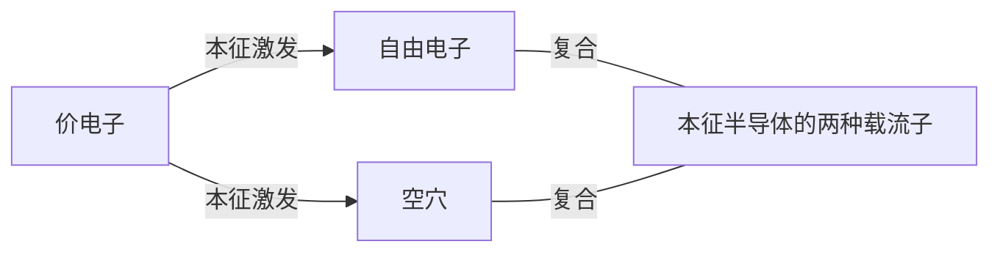
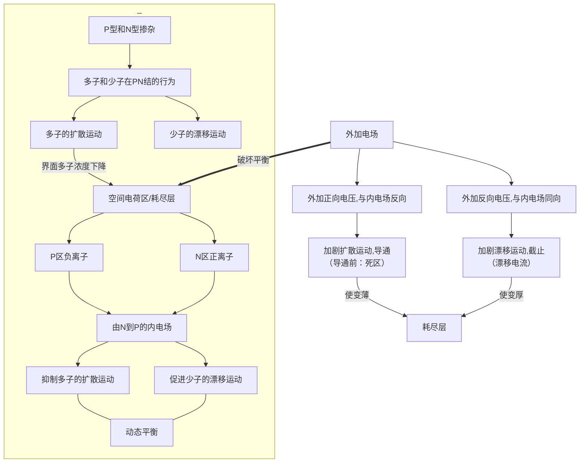
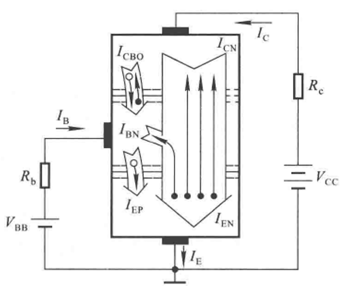

# 1 常用半导体
## 1.1 基础知识
### 1.1.1 本征半导体与其晶体结构

动态平衡
温度
载流子浓度

$$n_i = p_i = K_i T^ \frac 3 2 \mathrm e ^ \frac{-E_{CO}}{2kT}$$

### 1.1.2 杂质半导体
本征半导体中掺入少量杂质元素

**N（Negative）型半导体**
- 掺入P（+5）——成键之后，自由电子多余，多数载流子（多子），空穴是少数载流子（少子）
- 外界条件（温度）对多子的影响**小**、对少子的影响**大**（基数问题）
- P为**施主原子**

**P（Positive）型半导体**
- 掺入B（+3）——空穴多余，空穴多子，自由电子少子
- B为**受主原子**

### 1.1.3 PN结

#### 形成

多子的扩散运动
电场力作用下载流子（少子）的漂移运动

掺杂浓度的差异导致的不对称节/对称节

#### 单向导电性

- 正向电压：外加电场将载流子推过势垒（耗尽层），恢复多子的扩散运动
- 反向电压：耗尽层变厚，少子的漂移运动加强，对温度敏感
- 伏安特性曲线

#### 电流方程

$$ i = I_s(\mathrm e^{\frac{u}{U_T}} - 1)$$

- $u$外加电压，大小约为百毫伏
- $k$为玻尔兹曼常数
- $I_s$为反向饱和电流，即反向偏置下的电流，漂移电流占主导
- $300\mathrm K$下，温度的电压当量$U_T = kT/q = 26 \mathrm{mV}$

#### 伏安特性

正向特性：
- 死区
- $u \gg U_T,~ i \approx I_s \mathrm e^\frac{u}{U_T}$

反向特性：
- 反向击穿：共价键的破坏、电子-空穴对的大量产生
  - 雪崩击穿：少子的漂移运动撞出价电子。掺杂浓度低，PN结宽
  - 齐纳击穿：大场强直接破坏。掺杂浓度高，PN节窄
  - 齐纳击穿电压低
- $u \ll U_T,~ i \approx -I_s $

反向击穿通常导致烧毁（二次击穿）
高温促进齐纳击穿，抑制雪崩击穿

#### 电容效应

1. 势垒电容
   - 耗尽区离子电荷不可移动，可以视为电容器
   - 反向电压越大，耗尽区宽度越大，势垒电容$C_b$越小

2. 扩散电容
   - PN结平衡状态下的少子为平衡少子
   - 扩散区内，P→N的空穴/N→P的自由电子为非平衡少子
   - 非平衡少子的浓度梯度形成扩散电容$C_d$
   - 加压，浓度梯度变陡峭
   $i \uparrow$，非平衡少子寿命$\tau \uparrow$，$U_T \downarrow$，$C_d \uparrow$

3. 结电容
势垒电容和扩散电容分别响应电压变化，分别储存电荷，符合并联电容关系。
因此PN结结电容：$C_i = C_b + C_d$，通常可能的大小在$1\sim 100 \mathrm{pF}$

$X_C = \frac 1 {2\pi f C}$，$f\uparrow X_C\downarrow$，$C\uparrow X_C \downarrow$，二极管对高频信号的整流作用变差。
高频率下使用二极管相当于为结电容充放电。

## 1.2 二极管

### 1.2.1 常见结构

点接触型二极管：小结面积，小电容，小电流高频整流
面接触型二极管：大结面积，大电容，大电流低频整流
平面二极管：扩散法制成，根据结面积确定用途

### 1.2.2 伏安特性

#### 区别

- 体电阻的存在，电流小，压降大
- 表面漏电流，反向电流大一些
- 温度升高使正向特性左移，反向特性下移

近似分析仍使用之前的公式

开启电压、导通电压和反向饱和电流：

#### 温度的影响

下移和左移
每升高$1^\circ C$，正向压降减小$2\sim 2.5 \mathrm{mV}$
每升高$10^\circ C$，反向电流增大一倍

### 1.2.3 主要参数

1. 最大整流电流$I_\mathrm F$
长期运行时所允许的最大电流，与结面积和散热有关
2. 最高反向工作电压$U_\mathrm R$
通常标记为$U_\mathrm{(BR)}$的一半
3. 反向电流$I_R$
关系单向导电性
4. 最高工作频率$f_\mathrm M$
在最高工作频率以上，二极管单项导电性差

### 1.2.4 二极管的等效电路

——从非线性元件到线性元件

#### 伏安特性折线化

1. 理想二极管，严格单向导电
2. 开通电压：提供导通压降
3. 电阻

#### 二极管的微变等效电路

### 1.2.5 稳压二极管

#### 伏安特性

在$U_\mathrm Z$附近，极小的电压变化→极大的电流变化

#### 主要参数

1. 稳定电压$U_\mathrm Z$
对于一个二极管是确定值
2. 稳定电流$I_\mathrm Z$
工作时的电流大于最小稳定电流
3. 额定功耗$P_\mathrm{ZM}$
$P_\mathrm{ZM} = U_\mathrm Z I_\mathrm Z$
4. 动态电阻$r_\mathrm Z$
$r_\mathrm Z = \Delta U_\mathrm Z / \Delta I_\mathrm Z$
5. 温度系数$\alpha$
$\alpha = \Delta U_\mathrm Z / \Delta T$
温度升高促进低电压的齐纳击穿，因此温度系数为负（4V以下）
温度升高抑制高电压的雪崩击穿，因此温度系数为正（7V以上）
4V~7V，温度系数接近0，两种击穿均有

从计算角度理解稳压管电路：

将稳压二极管与限流电阻串联，使之在该状态下保持稳定的反向击穿，此时将稳压管看作电阻为$r_\mathrm Z$的一个小电阻。负载发生电阻的改变时，由于动态电阻较小，负载与稳压二极管整体并联的电阻变化相对限流电阻小，因此两端压降变化不明显。

### 1.2.6 其他类型二极管*

#### 发光二极管

#### 光电二极管

## 1.3 晶体三极管

双极晶体管(Biopolar Junction Transistor, BJT)，三极管

- 发射级e，ejection
- 基极b，basic
- 集电极c，collect

特点：
- 发射区发射载流子、掺杂浓度高
- 集电区收集载流子、掺杂浓度低、面积大
- 基区薄

两个结

- 发射结
- 集电结

箭头标出**发射结**导通的方向

NPN，P→N指向外侧
PNP，N←P指向内侧

#### 放大作用

#### 基本共射放大电路

三极管的正偏：发射结正偏

#### 晶体管内部载流子的运动

$I_\mathrm{EN}$，发射区向基区扩散的电子电流
$I_\mathrm{EP}$，基区向发射区扩散的空穴电流
$I_\mathrm{BN}$，基区内复合形成的电流
$I_\mathrm{CN}$，基区内非平衡少子向收集区扩散的电子电流
$I_\mathrm{CBO}$，基区与集电区平衡少子的漂移电流（收集结的反向最大电流）

基区：扩散、复合、产生

由此可见：

$$\begin{aligned}
I_{\mathrm{E}}&=I_{\mathrm{EN}}+I_{\mathrm{EP}}=I_{\mathrm{CN}}+I_{\mathrm{BN}}+I_{\mathrm{EP}} \\
I_{\mathrm{C}}&=I_{\mathrm{CN}}+I_{\mathrm{CBO}} \\
I_{\mathrm{B}}&=I_{\mathrm{BN}}+I_{\mathrm{EP}}-I_{\mathrm{CBO}}\\
&=I_{\mathrm{B}}^{\prime}-I_{\mathrm{CBO}}\end{aligned}$$

从外部看：
$$ I_{\mathrm{E}}=I_{\mathrm{C}} + I_{\mathrm{B}} $$

#### 共射放大系数

物理量：

1. 共射直流放大系数：
发射区发射的载流子中，能够被集电区有效收集的载流子数目与在基区复合导致基极电流产生的载流子数目之比

$$\overline \beta 
= \frac {I_\mathrm{CN}} {I_\mathrm B ^\prime}
= \frac{I_\mathrm C - I_\mathrm{CBO}}{I_\mathrm B + I_\mathrm{CBO}}$$

2. 共射交流放大系数：

$$\beta = \Delta i_\mathrm C / \Delta i_\mathrm B$$

3. 穿透电流$I_\mathrm{CEO}$：基极开路时（$I_\mathrm B = 0$时），由$V_\mathrm{CC}$驱动的、ce极间的电流

4. 反向电流$I_\mathrm{CBO}$：（发射极开路时）集电结的反向饱和电流

处理如下：

$$\begin{aligned}
I_\mathrm C 
&= \overline \beta (I_\mathrm B + I_\mathrm{CBO}) + I_\mathrm{CBO}
& \text{（对$\overline \beta$表达式化简）}\\
&= \overline \beta I_\mathrm B + I_\mathrm{CEO} 
& \text{（令$I_\mathrm B = 0$，根据$I_\mathrm{CEO}$的定义得到）}\\
&\approx \overline \beta I_\mathrm B
& \text{（$\overline \beta \gg 1,~ I_\mathrm{CEO} \ll I_\mathrm B$时）}\\
& \Longrightarrow I_\mathrm{CEO} = (1 + \overline \beta) I_\mathrm{CBO}
\end{aligned}$$

这表明当基极开路时，集电区和发射区之间的总电流$I_\mathrm{CEO}$不仅包括集电结的反向饱和电流$I_\mathrm{CBO}$，还包括由于基区少数载流子的扩散和复合所引起的额外电流。这部分额外电流与$\overline \beta$成正比。

交流前提下：
$$\begin{aligned}
i_{\mathrm{C}}
&= I_{\mathrm{c}} + \Delta i_{\mathrm{C}} \\
&= \bar{\beta} I_{\mathrm{B}} + I_{\mathrm{CEO}} + \beta \Delta i_{\mathrm{B}} \\
&\approx \bar{I}_{\mathrm{B}}+\beta \Delta i_{\mathrm{B}}
\end{aligned}
$$

5. 共基直流放大系数

$$\overline \alpha 
= \frac{I_\mathrm{CN}}{I_\mathrm E}
\approx \frac{I_\mathrm C}{I_\mathrm E} $$

对精确值展开：

$$
I_\mathrm C = \overline \alpha I_\mathrm E + I_\mathrm{CBO}
$$

由总电流关系，整理得：
$$\overline \alpha = \frac{\overline \beta}{1 + \overline \beta}$$
6. 共基交流放大系数

$$\alpha $$

