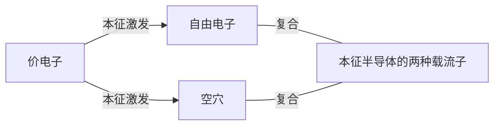
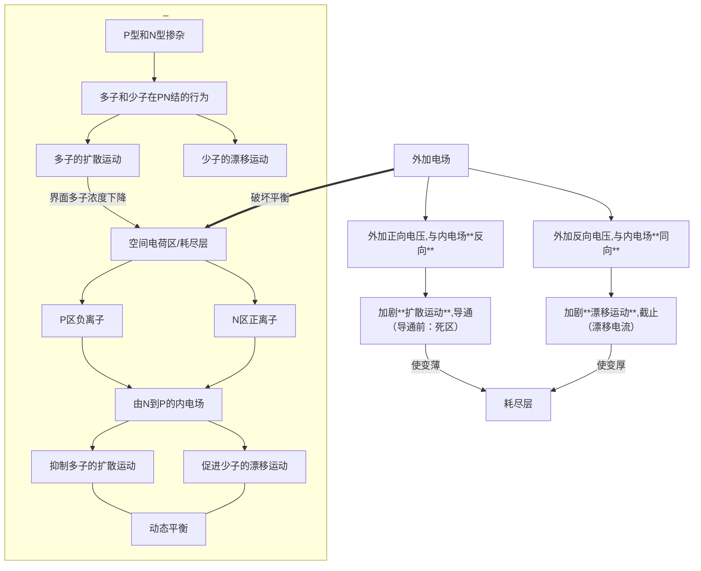
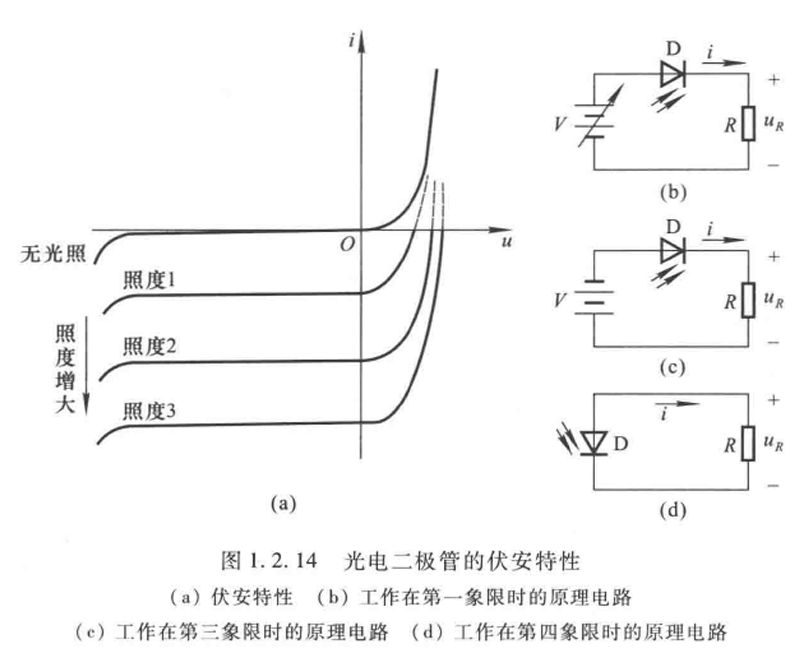

# 1 常用半导体
## 1.1 基础知识
### 1.1.1 本征半导体与其晶体结构

```mermaid
flowchart LR

价电子 -->|本征激发| 自由电子 & 空穴 ---|复合| 本征半导体的两种载流子

```

动态平衡

温度

载流子浓度

$$n_i = p_i = K_i T^ \frac 3 2 \mathrm e ^ \frac{-E_{CO}}{2kT}$$

### 1.1.2 杂质半导体
本征半导体中掺入少量杂质元素

**N（Negative）型半导体**
- 掺入P（+5）——成键之后，自由电子多余，多数载流子（多子），空穴是少数载流子（少子）
- 外界条件（温度）对多子的影响**小**、对少子的影响**大**（基数问题）
- P为**施主原子**

**P（Positive）型半导体**
- 掺入B（+3）——空穴多余，空穴多子，自由电子少子
- B为**受主原子**

### 1.1.3 PN结

#### 形成

**多子**由浓度差驱动的**扩散运动**
**少子**在电场力作用下的**漂移运动**

掺杂浓度的差异导致的**不对称节**/**对称节**

#### 单向导电性

```mermaid
flowchart TB


subgraph _

A[多子的扩散运动] 
B[少子的漂移运动]

P型和N型掺杂 --> 多子和少子在PN结的行为 --> A & B

A --> |界面多子浓度下降| 空间电荷区/耗尽层 --> P区负离子 & N区正离子 --> C[由N到P的内电场]

C --> 抑制多子的扩散运动 & 促进少子的漂移运动 --- 动态平衡
end


外加电场 ==>|破坏平衡| 空间电荷区/耗尽层
外加电场 --> 外加正向电压,与内电场**反向** --> D1[加剧**扩散运动**,导通</br>（导通前：死区）] -->|使变薄|D
外加电场 --> 外加反向电压,与内电场**同向** --> D2[加剧**漂移运动**,截止</br>（漂移电流）] -->|使变厚|D

D[耗尽层]
```

- 正向电压：外加电场将载流子推过势垒（耗尽层），恢复多子的扩散运动
- 反向电压：耗尽层变厚，少子的漂移运动加强，对温度敏感
- 伏安特性曲线

#### 电流方程

$$ i = I_s(\mathrm e^{\frac{u}{U_T}} - 1)$$

- $u$外加电压，大小约为百毫伏
- $k$为**玻尔兹曼常数**
- $I_s$为**反向饱和电流**，即反向偏置下的电流，漂移电流占主导
- $300\mathrm K$下，**温度的电压当量** $ U_T = kT/q = 26 \mathrm{mV} $

#### 伏安特性

能带弯曲 https://zhuanlan.zhihu.com/p/5907667912

正向特性：
- **死区**
- $u \gg U_T,~ i \approx I_s \mathrm e^\frac{u}{U_T}$

反向特性：

- $u \ll U_T,~ i \approx -I_s$
- 反向击穿：共价键的破坏、电子-空穴对的大量产生
  - **雪崩击穿**：少子的漂移运动撞出价电子。掺杂浓度低，PN结宽
  - **齐纳击穿**：大场强直接破坏。掺杂浓度高，PN节窄
  - **齐纳击穿电压低**

反向击穿通常导致烧毁（二次击穿）
**高温促进齐纳击穿，抑制雪崩击穿**

#### 电容效应

1. **势垒电容**
   - 耗尽区离子电荷不可移动，可以视为电容器
   - 反向电压越大，耗尽区宽度越大，势垒电容$C_b$越小

2. **扩散电容**
   - PN结平衡状态下的少子为平衡少子
   - 扩散区内，P→N的空穴/N→P的自由电子为非平衡少子
   - 非平衡少子的浓度梯度形成扩散电容$C_d$
   - 加压，浓度梯度变陡峭
   $i \uparrow$，非平衡少子寿命 $\tau \uparrow$， $U_T \downarrow$ ， $C_d \uparrow$

3. **结电容**
   势垒电容和扩散电容分别响应电压变化，分别储存电荷，符合并联电容关系。
   因此PN结结电容： $C_i = C_b + C_d$ ，通常可能的大小在 $1\sim 100 \mathrm{pF}$

$X_C = \frac 1 {2\pi f C}$， $f\uparrow X_C\downarrow$， $C\uparrow X_C \downarrow$，二极管对**高频信号的整流作用变差**。
高频率下使用二极管相当于为结电容充放电。

## 1.2 二极管

### 1.2.1 常见结构

点接触型二极管：小结面积，小电容，小电流高频整流
面接触型二极管：大结面积，大电容，大电流低频整流
平面二极管：扩散法制成，根据结面积确定用途

### 1.2.2 伏安特性

#### 区别

- **体电阻**的存在，电流小，压降大
- 表面**漏电流**，反向电流大一些
- 温度升高使正向特性左移，反向特性下移

近似分析仍使用之前的公式

开启电压、导通电压和反向饱和电流

#### 温度的影响

下移和左移
每升高 $1^\circ C$，正向压降减小 $2\sim 2.5 \mathrm{mV}$
每升高 $10^\circ C$，反向电流增大一倍

### 1.2.3 主要参数

1. **最大整流电流** $I_\mathrm F$
   长期运行时所允许的最大电流，与结面积和散热有关
2. **最高反向工作电压** $U_\mathrm R$
   通常标记为 $U_\mathrm{(BR)}$的一半
3. **反向电流** $I_R$
   关系单向导电性
4. **最高工作频率** $f_\mathrm M$
   在最高工作频率以上，二极管单向导电性差

### 1.2.4 二极管的等效电路

——从非线性元件到线性元件

#### 伏安特性折线化

1. 理想二极管，严格单向导电
2. 开通电压：提供导通压降
3. 电阻

#### 二极管的微变等效电路

### 1.2.5 稳压二极管

#### 伏安特性

在 $U_\mathrm Z$附近，极小的电压变化→极大的电流变化

#### 主要参数

1. **稳定电压** $U_\mathrm Z$
   对于一个二极管是确定值
2. **稳定电流** $I_\mathrm Z$
   工作时的电流大于最小稳定电流
3. **额定功耗** $P_\mathrm{ZM}$
   $P_\mathrm{ZM} = U_\mathrm Z I_\mathrm Z$
4. **动态电阻** $r_\mathrm Z$
   $r_\mathrm Z = \Delta U_\mathrm Z / \Delta I_\mathrm Z$
5. **温度系数** $\alpha$
   $\alpha = \Delta U_\mathrm Z / \Delta T$
   温度升高促进低电压的齐纳击穿，因此**齐纳击穿温度系数为负**（4V以下）
   温度升高抑制高电压的雪崩击穿，因此**雪崩击穿温度系数为正**（7V以上）
   4V~7V，温度系数接近0，两种击穿均有

从计算角度理解稳压管电路：

将稳压二极管与限流电阻串联，使之在该状态下保持稳定的反向击穿，此时将稳压管看作电阻为$r_\mathrm Z$的一个小电阻。负载发生电阻的改变时，由于动态电阻较小，负载与稳压二极管整体并联的电阻变化相对限流电阻小，因此两端压降变化不明显。

### 1.2.6 其他类型二极管*

#### 发光二极管

Light Emitting Diode, LED

#### 光电二极管

Photodiode

