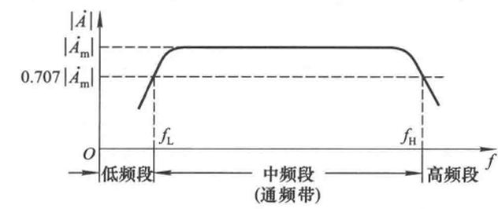
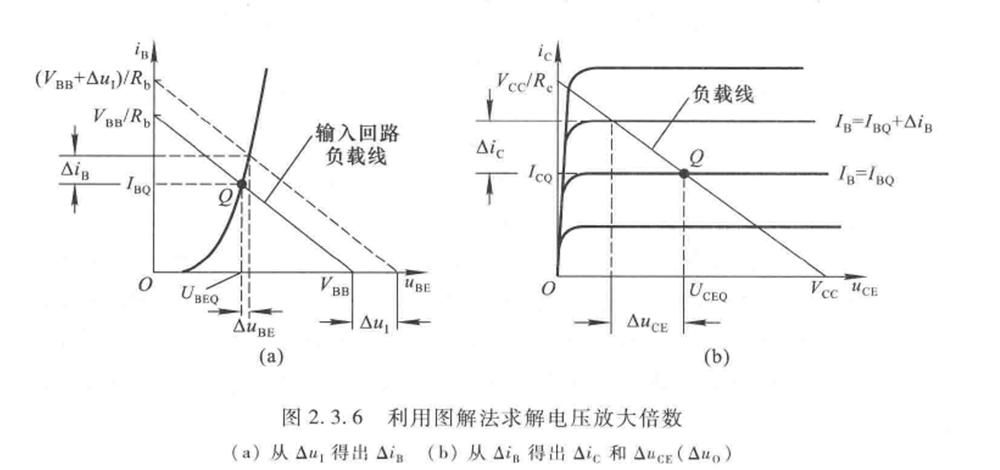
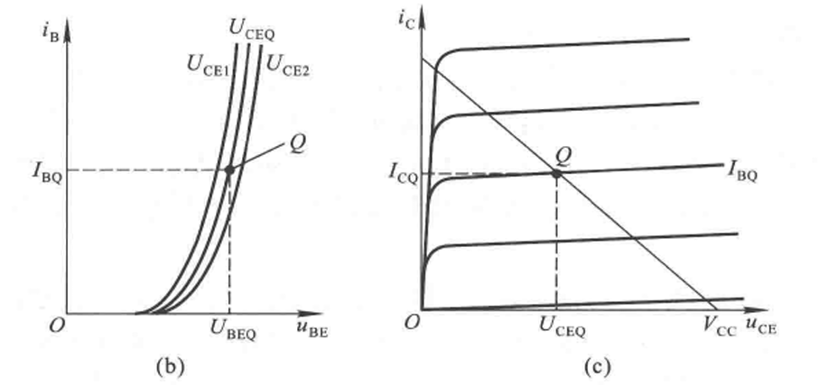
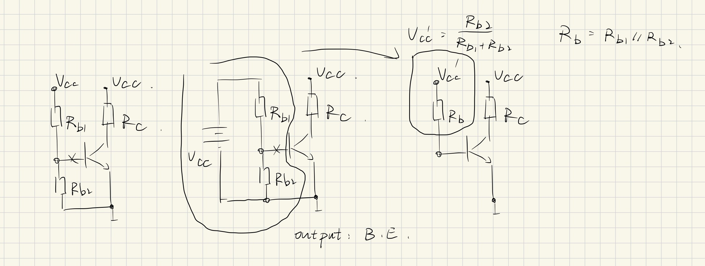
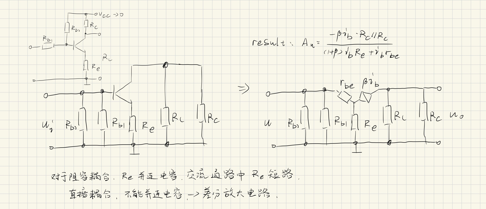

# 2 基本放大电路

## 2.1 放大电路的构成

### 2.1.1 放大的概念

1. 特征：功率的放大
2. 本质：对能量的控制和转换
3. 必要条件：有源元件
4. 前提：不失真/保真
5. 测试信号：正弦波

#### 如何构建放大电路

1. 目标：小功率→大功率
2. 条件：元件（有源元件）、电源
3. 技术路线
   1. 放大状态的三极管， $i_\mathrm{B}$ 控制 $i_\mathrm{C}$
   2. 小信号 控制 $i_\mathrm{B}$ ( $u_\mathrm{BE}$ )
   3. 合理的输出
   4. 放大电路
      1. 直接耦合
      2. 阻容耦合
   5. 工作原理

### 2.1.2 放大电路的性能指标

#### 输入电阻

对于信号源而言，放大电路是信号源的一个负载，这个负载的电阻为**输入电阻** $R_\mathrm i$

对于电压型信号源，应让 $R_\mathrm{i}$ 尽量大，使得放大电路分得足够电压，减小信号源的输出功率避免畸变。

#### 输出电阻

对于输出端，放大电路是一个非理想电源 $U_\mathrm o ^\prime$ ，内阻为**输出电阻** $R_\mathrm{o}$，在负载下的输出为 $U_\mathrm{o}$ 

为使得负载的 $R_\mathrm{L}$ （外阻）在变化时，输出的电压 $U_\mathrm o$ 变化小，则希望内阻（输出电阻） $R_\mathrm{o}$ 小。

相应的，如果想使得负载变化时输出电流变化小，则希望“内阻”大，使得外阻变化可以忽略。

#### 放大倍数

A stands for amplification

|电压放大倍数 $\dot{A}_\mathrm{uu}$|电流放大倍数 $\dot{A}_\mathrm{ii}$|电压对电流的放大倍数 $\dot{A}_\mathrm{ui}$|电流对电压的放大倍数$\dot{A}_\mathrm{iu}$|
|---|---|---|---|
|输出电压/输入电压|输出电流/输入电流|输出电压/输入电流|输出电流/输入电压|

#### 通频带

#### 非线性失真系数*

**谐波成分与基波成分之比**

$$D = \sqrt{\left(\frac{A_2}{A_1}\right)^2 + \left(\frac{A_3}{A_1}\right)^2 + \cdots}$$

$A_1$: 基波幅值

$A_2,~ A_3,~ \dots$ : 谐波幅值

#### 最大不失真输出电压

更大的信号会失真

确定非线性失真系数 $D$ 的额定值，输出波形的非线性失真系数刚达到此额定值时的电压即最大不失真输出电压。

认定**有效值** $U_\mathrm{om}$ 或**峰峰值**(peak2peak) $U_\mathrm{opp} = 2\sqrt2 U_\mathrm{om}$

#### 最大输出功率与效率

保证不失真的条件下在负载上输出的最大功率

负载上的最大功率 $P_\mathrm{om}$ 电源功率 $P_\mathrm{V}$ 的比值 $\eta$ 为功率放大电路的效率

## 2.2 基本共射放大电路的工作原理*

### 2.2.1 组成与各元件作用

### 2.2.2 静态工作点

Q=Quiescent

### 2.2.3 工作原理和波形分析

### 2.2.4 组成原则

#### 原则

#### 直接耦合和阻容耦合

## 2.3 放大电路的分析方法*

二极管的微变等效电路→直流点的位置（静态）和线性化（动态）

### 2.3.1 直流通路和交流通路

#### 直流通路

$u_\mathrm{i} = 0$ 电容=断路，电感=短路

观察直流通路可以检查电路在静态上的问题

#### 交流通路

交流单独作用下的通路，直流置零。电容=短路（足够高频，容抗为零）

### 2.3.2 图解法

#### 静态工作点和放大倍数的分析

研究 $\Delta u_\mathrm i$ 和 $\Delta u_\mathrm o$ 之间的关系

先找静态点 $Q$ ，先找直流通路。

对于一个接有 $R_\mathrm{b},R_\mathrm{c}$ 的基本共射放大电路：

两条直线的方程：
1. 输入回路负载线 $I_\mathrm BQ = \frac{V_\mathrm{bb} - U_\mathrm{BEQ}}{R_b}$
2. 输出 $I_\mathrm{CQ} = \beta I_\mathrm{BQ}$ 以及 $U_\mathrm{CEQ} = V_\mathrm{CC} - I_\mathrm{CQ}R_\mathrm{c}$

#### 非线性失真：截止失真和饱和失真*

### 2.3.3 等效电路法

#### 直流模型和静态工作点

1. $Q$ 点，静态工作点。
2. $r_\mathrm{be} \approx r_\mathrm{bb'} + (1+\beta)\frac{U_\mathrm{T}}{I_\mathrm{EQ}}$
   $\approx r_\mathrm{bb'} + (1+\beta)\frac{U_\mathrm{T}}{I_\mathrm{EQ}}$
   1. $r_\mathrm{be}$ 静态工作点，交流通路的 $\frac{\Delta u_\mathrm{be}}{\Delta i_\mathrm b}$
   2. $r_\mathrm{bb'}$ 基区体电阻，基极端子（b）到晶体管内部有效基区（b'）的体电阻。$100 \sim 300 \Omega$。
   3. $I_\mathrm{EQ}$ 是 $I_\mathrm{b}$ 的体现。
   （三极管 $r_\mathrm{be}$ 的推导参见专题1）
   
符号：
1. $i_\mathrm{B}$ 瞬时
2. $I_\mathrm{B}$ 直流
3. $i_\mathrm{b}$ 瞬时的交流分量
4. $\dot I_\mathrm{b}$ 正弦交流量的向量
5. $I_\mathrm{b}$ 正弦交流量的有效值

#### $h$ 参数等效模型

h stands for hybrid

用双口网络看三极管：混合参数的模型
注意， $h$ 参数模型是用来分析交流通路的

$$\begin{cases}
   u_\mathrm{BE} = f_1(i_\mathrm{B},~ u_\mathrm{CE})\\
   i_\mathrm{C} = f_2(u_\mathrm{CE},~ i_\mathrm{B})
\end{cases}$$

端口特性的自变量都是 $i_\mathrm{B},~ u_\mathrm{CE}$

全微分：

$$\mathrm d u_\mathrm{BE} = \left.\frac{\partial u_\mathrm{BE}}{\partial i_\mathrm{B}}\right|_{U_\mathrm{CE}} \mathrm d i_\mathrm{B} + \left.\frac{\partial u_\mathrm{BE}}{\partial u_\mathrm{CE}}\right|_{I_\mathrm{B}} \mathrm d u_\mathrm{CE}$$

$$\mathrm d i_\mathrm{C} = \left.\frac{\partial i_\mathrm{C}}{\partial i_\mathrm{B}}\right|_{U_\mathrm{CE}} \mathrm d i_\mathrm{B} + \left.\frac{\partial i_\mathrm{C}}{\partial u_\mathrm{CE}}\right|_{I_\mathrm{B}} \mathrm d u_\mathrm{CE}$$

$h_{11} = \left.\frac{\partial u_\mathrm{BE}}{\partial i_\mathrm{B}}\right|_{U_\mathrm{CE}},~ h_{12} = \left.\frac{\partial u_\mathrm{BE}}{\partial u_\mathrm{CE}}\right|_{I_\mathrm{B}},~ h_{21} = \left.\frac{\partial i_\mathrm{C}}{\partial i_\mathrm{B}}\right|_{U_\mathrm{CE}},~ h_{22} = \left.\frac{\partial i_\mathrm{C}}{\partial u_\mathrm{CE}}\right|_{I_\mathrm{B}}$

物理含义： $h_{11} = r_\mathrm{be}$

$u_\mathrm{CE}$ 对输入曲线的影响（图中b）： $u_\mathrm{CE} > 1~\mathrm V,~ h_{12} < 0.01$

物理含义： $h_{21} = \beta$

$u_\mathrm{CE}$ 对输出曲线的影响（图中c）： $h_{22} = \frac{1}{r_\mathrm{CE}} < 10^{-5}$

简化 $h$ 参数等效，就是前述的微变等效电路。

## 2.4 放大电路Q点稳定的必要性

### 2.4.1 必要性

#### 对Q点的影响

1. 温度
2. $V_\mathrm{CC}$ 的波动
3. 元件的老化

#### 思路

温度上升， $I_\mathrm C$ 上升，再提供一个量，使得 $I_\mathrm C$ 再下降，这对基本共射放大电路而言：

1. $i_\mathrm B$ 控制了 $i_\mathrm C$
2. $u_\mathrm{BE}$ 控制了 $i_\mathrm B$
3. 改变E点电位
4. 在接地点和E间加电阻

$T\uparrow, I_\mathrm C\uparrow, I_\mathrm E\uparrow, u_\mathrm E\uparrow, u_\mathrm{BE}\downarrow(?), I_\mathrm B \downarrow, I_\mathrm C\downarrow$

需要假定 $u_\mathrm{BE}$ 不变，如何稳定B点电位？

在接地点和B点间加电阻 $R_\mathrm{B2}$ 并使得两点之间的电流远大于 $I_\mathrm B$ ，这样可以认为B点电势就取决于 $R_\mathrm{B1}, R_\mathrm{B2}$ 的分压情况。

### 2.4.2 Q点稳定的电路

#### 构成与分析

1. 直流通路：在 $I_\mathrm B$ 可以忽略时使用戴维南定理，进行如下的等效：

   

   $V_\mathrm{CC'} = \frac{R_\mathrm{b2}}{R_\mathrm{b1} + R_\mathrm{b2}}, R_\mathrm b = R_\mathrm{b1} \parallel R_\mathrm{b2}$

2. 交流通路：
   

3. 总结结论：
   $$\begin{cases}
      A_u = -\frac{\beta R_\mathrm L '}{(1+\beta)R_\mathrm{e} + r_\mathrm{be}} & (R_\mathrm{L}' = R_\mathrm c \parallel R_\mathrm{L})\\
      R_\mathrm i = \frac{\dot U_\mathrm i}{\dot I_\mathrm i} = R_\mathrm{b1}\parallel R_\mathrm{b2} \parallel \left[ r_\mathrm{be} + (1+\beta) R_\mathrm e \right]\\
      R_\mathrm{o} = R_\mathrm{e}
   \end{cases}$$

# 推导过程

## 三极管 $r_\mathrm{be}$ 的推导

推导参见专题1