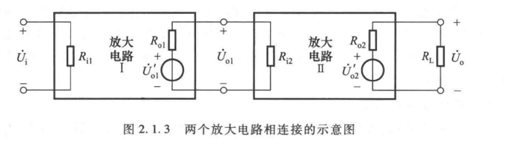
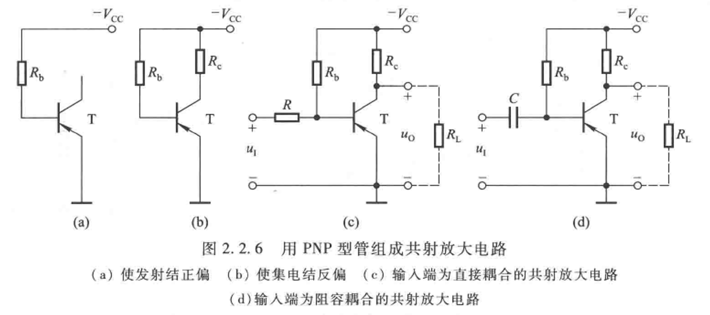
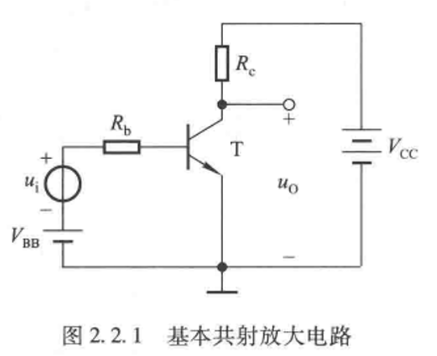
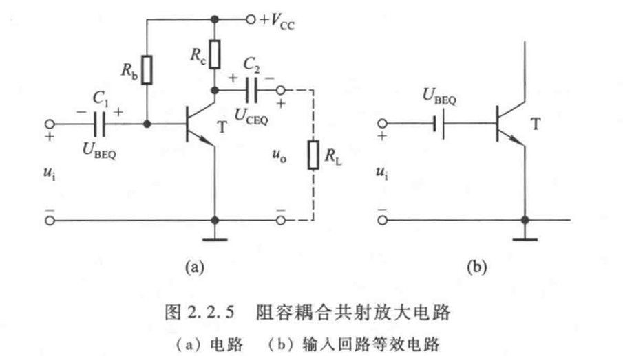

## 2.1 放大的概念与放大电路的性能指标

### 2.1.1 在放大电路中，输出电流和输出电压是由有源元件提供的吗？为什么？

pass

### 2.1.2 在放大电路中，输出电压是否一定大于输入电压？输出电流是否一定大于输入电流？放大电路放大的特征是什么？

不一定
    
放大电路的核心功能是功率放大，而非单纯电压或电流放大。具体取决于电路类型：

### 2.1.3 
已知放大电路空载时的电压放大倍数 $|\dot A _\mathrm{u}| = u_\mathrm{o} / u_\mathrm{i}$ ( $u_\mathrm{o}, u_\mathrm{i}$ 均为有效值)、输入电阻和输出电阻 $R_\mathrm{i},R_\mathrm{o}$ ，求 $|\dot A _\mathrm{ui}|,|\dot A _\mathrm{iu}|,|\dot A _\mathrm{ii}|$

### 2.1.4 两级放大电路的方框图如图2.1.3所示，已知电路I和电路II空载时的电压放大倍数，以及它们的输入电阻和输出电阻，试求解整个电路的电压放大倍数

 

## 2.2 基本共射放大电路的工作原理

### 2.2.1 试用NPN型管组成一个共射放大电路，使之在输入值为0时输出为0。（可用一路电源，也可两路电源）

### 2.2.2 标出图2.2.6(d)中耦合电容的极性

### 2.2.3 PNP管共射放大电路的输出电压和输入电压反向吗？用波形分析。

### 2.2.4 在图2.2.1的电路中，若输出端负载 $R_\mathrm{L}$ ，如何求解静态管压降 $U_\mathrm{CEQ}$ ？

## 2.3 放大电路的分析方法

### 2.3.1 若输入信号为直流则用直流通路分析，若输入信号为交流则用交流通路分析。对吗？为什么？

### 2.3.2 尝试用图解法分别说明如何消除图2.2.1，图2.2.5(a)所示的两放大电路的截止失真和饱和失真

 

### 2.3.3 利用等效电路法求解出的电压放大倍数、输入电阻和输出电阻都是在中频小信号下的参数，在大信号下这些参数有变化吗？为什么？

### 2.3.4 分别说明采用什么措施可以增强图2.2.1和图2.2.5(a)所示共射放大电路的电压放大能力，采用什么措施可以增大输入电阻；并说明增大输入电阻对电压放大倍数有什么影响。

