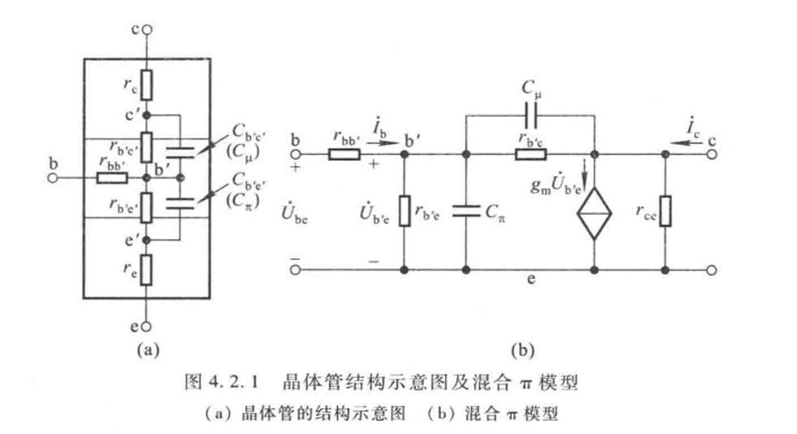
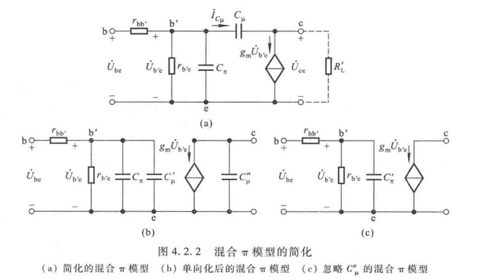
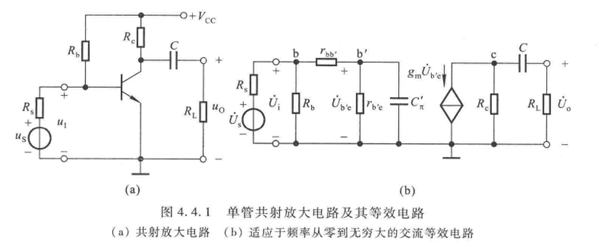
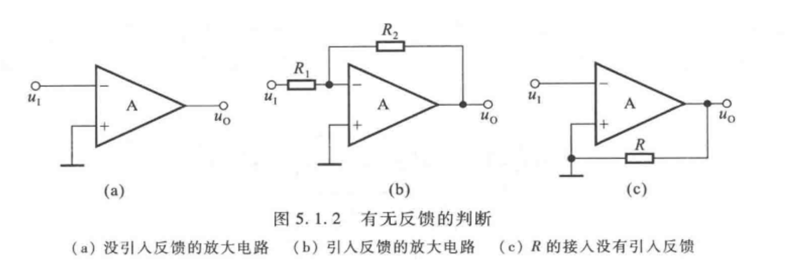
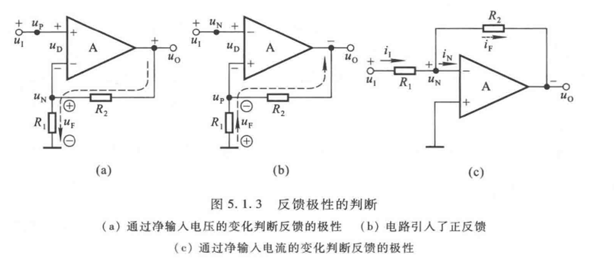
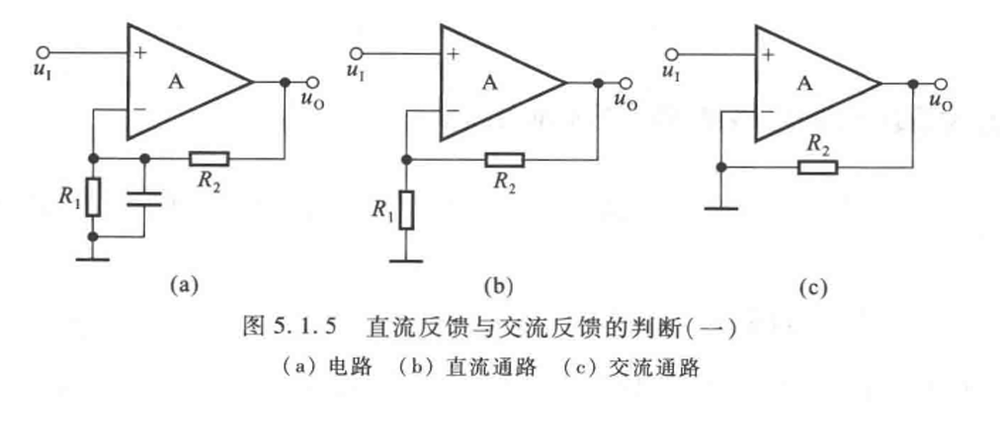
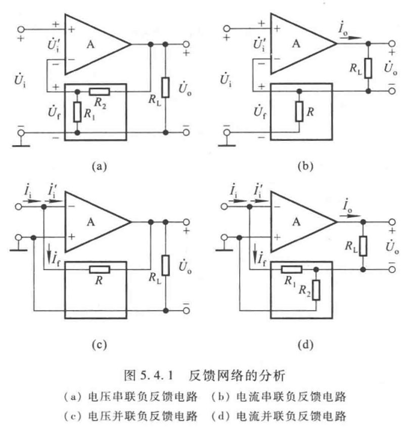
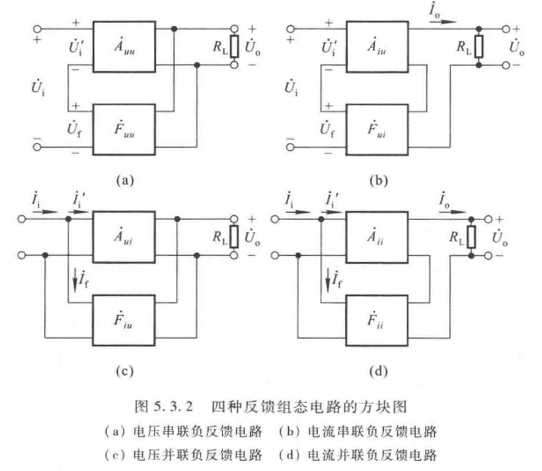
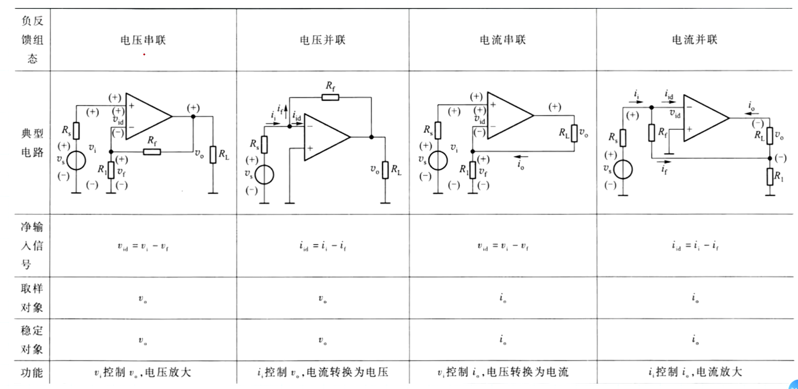

# 4 放大电路的频率响应

（参考教材的第四章）

## 4.1 概述

### 4.1.2 基本概念

#### 高通电路

RC电路，接电阻输出，高频可通，不用了解推导

$\dot A_{uf} = \frac{1}{1+\frac{f_L}{jf}}$

#### 低通电路

RC电路，接电容输出，低频可通，不用了解推导

$\dot A_{uf} = \frac{1}{1+\frac{jf}{f_H}}$

这里的 $f$ 

#### 时间常数

$\tau=RC$

## 4.2 高频等效

### 4.2.1 $\pi$ 模型

#### 完整的pi模型 （混合pi模型）

#### 简化pi模型

1. 认为 $r_{ce}, r_{b'e}$ 开路：去除 $r_{ce}, r_{b'e}$
2. $C_\mu$ 不好分析，单向化：等效为 $C_\mu'$ 和 $C_\mu''$
3. 最后忽略 $C_\mu''$

## 4.4 单管放大电路的频率响应

### 4.4.1 共射

阻容耦合单管共射放大电路的频率响应分析

#### 中频

分段：

1. $R_b$ 分压输出
2. $r_{b'e}$ 的分压
3. 右侧输出

因此空载中频放大倍数： $\dot A_{usm}=\frac{\dot U_i}{\dot U_s}\frac{\dot U_{b'e}}{\dot U_i}\frac{\dot U_o}{\dot U_{b'e}}=\frac{R_b}{R_s+R_b}\frac{r_{b'e}}{r_{b'e}+r_{bb'}}(-g_mR_c)$

#### 低频

分析低频，则要分析高通电路（这里是输出回路），给原本的中频放大倍数乘上 $\dot A_{uf} = \frac{1}{1+\frac{f_L}{jf}}$

$f_L$ 为下限频率，这一电路中的大小为 $f_L=\frac{1}{2\pi(R_c+R_L)C}$

下限频率表现为放大倍数波特图中的拐点

多个下限频率为 $f_{Ln}$ 的高通电路相连，下限频率 $f_L = 1.1\sqrt{\sum_{n=1}f_L^2}$

#### 高频

分析高频，则要画低通电路（这里是输入回路），给原本的中频放大倍数乘上 $\dot A_{uf} = \frac{1}{1+\frac{jf}{f_H}}$

$f_H$ 为上限频率，这一电路中的大小为 $f_H=\frac{1}{2\pi RC_\pi'}=\frac{1}{2\pi\tau}$, $R$ 是（戴维南）等效的、与 $C_\pi'$ 串联的电阻

多个上限频率为 $f_{Hn}$ 的低通电路相连，上限频率 $\frac{1}{f_H} = 1.1\sqrt{\sum_{n=1}\frac{1}{f_H^2}}$

#### 总结：全频域

全频域即中频乘上高频和低频的两个系数： $\dot A_u = \dot A_{usm} \dot A_{ufl} \dot A_{ufh} = \frac{\dot A_{usm}}{(1+\frac{f_L}{jf})(1+\frac{jf}{f_H})}$

#### 波特图

两种题：

1. 从波特图求放大倍数表达式
2. 从表达式推参数和波特图

具体可以参见作业

# 5 放大电路中的反馈

## 5.1 概念和判断

### 5.1.1 概念

#### 直流反馈和交流反馈

直流通路中的反馈和交流通路中的反馈

### 5.1.2 判断

https://www.zhihu.com/question/522154627

输出回路和输入回路相连的电路

#### 判断有无

输出和输入回路间有无反馈通路？

#### 判断极性

瞬时极性法

在分析时，将反馈量看作输出量产生的效果，将输出看作独立源

假设导入一个对地为+的信号，$u_N$ 就会大于0，输入端的压差变小，输出变小。

$u_F = \frac{u_oR_1}{R_1+R_2}$

输入 $u_D = u_i - u_F$

#### 判断直流交流

反馈通路存在于直流通路/交流通路？

这个是仅有直流反馈

## 5.2

### 5.2.2 四种负反馈（判断）

电压/电流 x 串联/并联 组合 - 4种

#### 电压/电流反馈

电压/电流反馈描述了放大电路的输出量是以什么形式输入反馈网络的。

1. 如果反馈网络与负载并联，反馈网络就会收到以电压形式存在的输出，因此我们将这种反馈称为电压反馈
2. 如果反馈网络与负载串联，反馈网络就会收到以电流形式存在的输出，因此我们将这种反馈称为电流反馈

#### 串联/并联反馈

串联/并联反馈描述了反馈网络的输出量是以什么形式反馈给放大电路的。

1. 如果反馈网络的输出端口与放大电路的输入端口直接连接在一起，就会将网络中的电流汇入输入作为反馈，能将电流进行汇聚的反馈，称为并联反馈
2. 如果反馈网络的输出端口连接到了与放大电路的输入端口反相的输入端口，就会将反馈网络的输出端口的电势作为反馈，改变了两点间电势的反馈，称为串联反馈

#### 判断方式

前面的解释就足够清楚了，或者用以下的方法：（点击展开）

1. 电压or电流？：令放大电路输出电压0（短接负载），若反馈量变为0，则是电压反馈，反之是电流反馈 - 没有对应的输出就没有反馈！另一个判断方法：
   1. 找到电路中属于反馈网络的部分
   （基本上除了放大电路和输出负载，剩下的都是反馈网络的成分）
   2. 观察反馈网络与放大电路的连接方式，用前文所说的方法判断
2. 串联or并联？：反馈信号和输入信号接在同一端，则是并联反馈，否则是串联反馈
   1. 并联反馈的形式为电流叠加，串联反馈的形式为电压叠加

两者的判断不分先后。

一个不太准确（我不懂）的判断方法（点击展开）

以上图为例：
1. （a）中短接 $R_L$ 会导致 $R_1, R_2$ 均一端接地，反馈量不再变化（为0）
2. （b）中短接 $R_L$ 后，放大器反相输入位置的电势可以通过改变通过 $R$ 的电流改变，反馈量依然存在
3. （c）中短接 $R_L$ 会导致反馈的 $R$ 一端接地
4. （d）中短接 $R_L$ 放大器反相输入位置的电势可以通过改变通过 $R_1$ 的电流改变，反馈量依然存在

解释：（点击展开）

1. 输出端
   1. 反馈量取自输出电压 - 电压反馈 - 稳定输出电压
   2. 反馈量取自输出电流 - 电流反馈 - 稳定输出电流
2. 输入端
   1. 反馈量以电压方式叠加 - 串联反馈 - 减小净输入电压 - 接电压信号源
   2. 反馈量以电流方式叠加 - 并联反馈 - 减小净输入电流 - 接电流信号源

## 5.3 方块图和表达式

### 5.3.1-2 方块图

任何负反馈放大电路都可以通过方块图表示，前面的工作相当于让我们知道两个部分都做了什么。

1. $\dot X_i$ 输入量
2. $\dot X_f$ 反馈量
3. $\dot X_i'=\dot X_i - \dot X_f$ 净输入
4. $\dot X_o$ 输出量

电路参数
1. $\dot A = \frac{\dot X_o}{\dot X_i'}$ 基本放大电路放大倍数
2. $\dot F = \frac{\dot X_f}{\dot X_o}$ 反馈系数 - 由**输出**得到**反馈量** - 因为反馈方式的不同而有可能有不同的单位
3. $\dot A_f = \frac{\dot X_o}{\dot X_i}$ 反馈放大电路的放大倍数 - 由输入电压得到输出电压

一般题目会给出一个负反馈放大电路，要求计算反馈系数/反馈后的电压放大倍数

表格：各种量和它们的定义，四种负反馈对比（点击展开）

| 反馈组态 | $\dot{X}_{i} \dot{X}_{f} \dot{X}_{i}^{\prime}$ | $\dot{X}_{o}$ | $\dot{A}$ | $\dot{F}$ | $\dot{A}_{f}$ | 功 能                                    |
| ---- | ---- | ---- | ---- | ---- | ---- | ---- |
| 电压串联 | $\dot{U}_{i} \dot{U}_{f} \dot{U}_{i}^{\prime}$ | $\dot{U}_{o}$ | $\dot{A}_{uu}=\frac{\dot{U}_{o}}{\dot{U}_{i}^{\prime}}$ | $\dot{F}_{u u}=\frac{\dot{U}_{f}}{\dot{U}_{o}}$ | $\dot{A}_{uuf}=\frac{\dot{U}_{o}}{\dot{U}_{i}}$ | $\dot{U}_{i}$ 控制 $\dot{U}_{o}$,电压放大    |
| 电流串联 | $\dot{U}_{i} \dot{U}_{f} \dot{U}_{i}^{\prime}$ | $\dot{I}_{o}$ | $\dot{A}_{iu}=\frac{\dot{I}_{o}}{\dot{U}_{i}^{\prime}}$ | $\dot{F}_{u i}=\frac{\dot{U}_{f}}{\dot{I}_{o}}$   | $\dot{A}_{iuf}=\frac{\dot{I}_{o}}{\dot{U}_{i}}$ | $\dot{U}_{i}$ 控制 $\dot{I}_{o}$,电压转换成电流 |
| 电压并联 | $\dot{I}_{i} \dot{I}_{f} \dot{I}_{i}^{\prime}$ | $\dot{U}_{o}$ | $\dot{A}_{ui}=\frac{\dot{U}_{o}}{\dot{I}_{i}^{\prime}}$ | $\dot{F}_{i u}=\frac{\dot{I}_{f}}{\dot{U}_{o}}$   | $\dot{A}_{uif}=\frac{\dot{U}_{o}}{\dot{I}_{i}}$ | $\dot{i}_{i}$ 控制 $\dot{U}_{o}$,电流转换成电压 |
| 电流并联 | $\dot{I}_{i} \dot{I}_{f} \dot{I}_{i}^{\prime}$ | $\dot{I}_{o}$ | $\dot{A}_{ii}=\frac{\dot{I}_{o}}{\dot{I}_{i}^{\prime}}$ | $\dot{F}_{i i}=\frac{\dot{I}_{f}}{\dot{I}_{o}}$   | $\dot{A}_{iif}=\frac{\dot{I}_{o}}{\dot{I}_{i}}$ | $\dot{i}_{i}$ 控制 $\dot{I}_{o}$,电流放大    |

### 5.3.3 一般表达式

$\dot A_f = \frac{\dot A}{1+\dot A \dot F}$

## 5.4 深度负反馈

### 5.4.1 实质

$|1+\dot A\dot F| \gg 1$, $\dot A_f \approx \frac 1 {\dot F}$

### 5.4.2-3 网络/放大倍数分析

根据表格计算：

https://www.bilibili.com/video/BV1aT4y1T7Dd

#### 计算放大系数

1. 电压串联： $\dot A_{uuf} = \frac{1}{\dot F_{uu}}$
2. 电流串联： $\dot A_{iuf} = \frac{1}{\dot F_{ui}} \rightarrow A_{uf}=\frac{1}{F_{ui}}R_L$
3. 电压并联： $\dot A_{uif} = \frac{1}{\dot F_{iu}} \rightarrow \dot A_{usf}=\frac{1}{\dot F_{iu}}\frac{1}{R_s}$
4. 电流并联： $\dot A_{iif} = \frac{1}{\dot F_{ii}} \rightarrow \dot A_{usf}=\frac{1}{\dot F_{ii}}\frac{R_L}{R_s}$

但是更常用的方法还是直接 $\frac{X_o}{X_i'}$

#### 反馈网络分析：虚短虚断

https://www.bilibili.com/video/BV12D4y1h7qz

1. 虚短，存在负反馈时会因为负反馈的作用而使得两输入端间电势差很小
2. 虚断：流进放大器的电流很小 - 理想运放的输入阻抗无穷大

