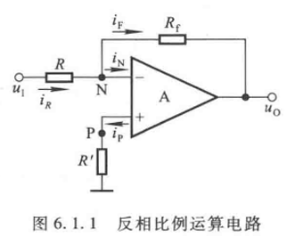
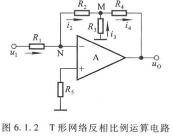
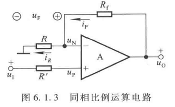
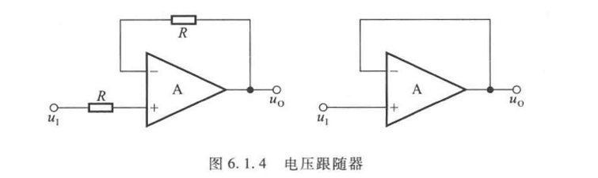
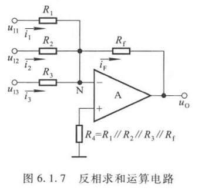
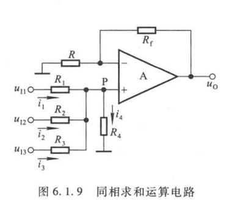

# 6 信号的运算和处理

## 6.1 基本运算电路

### 6.1.2 比例运算电路

#### 反相比例运算电路

反相比例运算电路 - 电压并联负反馈电路

1. $u_O, u_I$ 反相
2. $R'=R\parallel R_f$ 补偿电阻
3. $u_N=u_P=0$ 虚地且 $i_P=i_N=0$
4. 对结点N写电流方程，解出 $u_O=-\frac{R_f}{R}u_I$
5. 深度负反馈，输出电阻为0
6. 输入端对地等效电阻即输入端对虚地等效电阻 $R$

#### T形网络反相比例运算电路

1. 分析过程
   1. N的电流方程
   2. M的电位
   3. 各个电流
   4. 输出输入关系
2. 结论 
   1. $u_O=-\frac{R_2+R_4}{R_1}(1+\frac{R_2\parallel R_4}{R_3})u_I$
   2. $R_I=R_1$

#### 同相比例运算电路

1. 分析过程
   1. 根据虚短/虚断的概念，净输入电压为0，$u_P=u_N=u_I$，说明有共模输入
   2. 净输入电流为0，$i_R=i_P$
2. 结论
   1. $u_O = (1+\frac{R_f}{R})u_I$ 同相且更大
   2. 电压串联负反馈，输入电阻 $\infty$，输出电阻 0

#### 电压跟随器

全部反馈到反相输入端，电压串联负反馈，反馈系数为1。输入电阻 $\infty$， 输出电阻为0

### 6.1.3 加减运算电路

#### 反相求和

1. 过程
   1. 净输入电压为0
   2. N的电流方程
2. 结果
   1. $u_0=-R_f\sum_{n=0}^{3}\frac{u_{In}}{R_n}$
3. 如果 $u_{I1}$ 单独作用，$u_{I2}, u_{I3}$ 接地
   1. 这时 $i_2=i_3=0$ 做反相比例运算 $u_{O1}=-\frac{R_f}{R_1}u_{I1}$
   2. 根据叠加原理，同时作用，得到的结果就是反相求和

#### 同相求和

## 别的运算不讲