# 7 波形的发生和信号的转换

## 7.1 正弦波振荡电路
### 7.1.1 概述

#### 基本原理和平衡条件

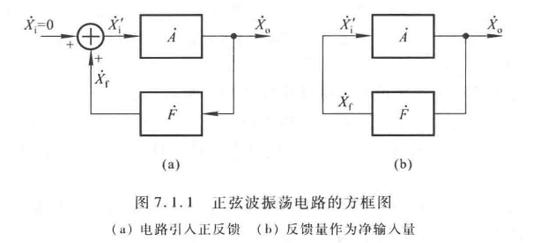

假设瞬时极性发生，则 $\dot X_o = \dot A \dot X_f = \dot A \dot F \dot X_o$

引入正反馈，但是不会无限增大。放大电路放大倍数减小直到达到平衡，平衡条件：

$$\dot A \dot F = 1$$


#### 组成和分类

组成：
1. 放大电路：起振-幅值增大-平衡-一定幅值的输出量
2. 选频网络：确定振荡频率
3. 正反馈网络：放大电路的输入=反馈
4. 稳幅环节：非线性、稳定幅值的环节

有些时候正反馈网络和选频网络合并。

根据选频网络的元件命名：xx正弦振荡电路
1. RC
2. LC
3. 石英晶体

#### 判断有无振荡

1. 判断有无上述四个组分
2. 判断放大电路是否工作正常（静态工作点、动态信号能否输入/输出/放大）
3. 判断相位条件（是否自激）：
   1. 断开反馈
   2. 给放大电路加正弦 $\dot U_i$ 并确定瞬时极性（比如+）
   3. 通过这个 $\dot U_i$ 产生的 $\dot U_f$ 极性要与 $\dot U_i$ 相同
4. 要满足 $|\dot A \dot F| > 1$ 起振条件

### 7.1.2 RC正弦波振荡

#### RC串并联选频网络（文氏电桥）

输入： $\dot U_o$

输出： $\dot U_f$

因此它既是选频网络也是反馈网络

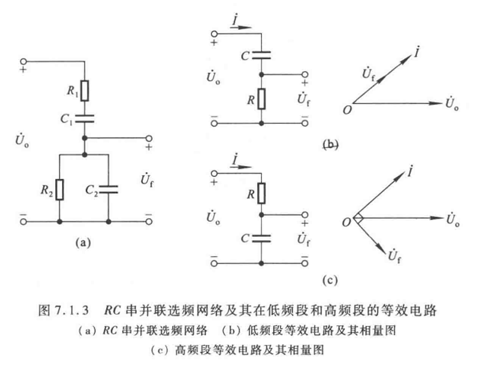

信号频率低， $\dot U_f$ 超前 $90^\circ$。信号频率高， $\dot U_f$ 滞后 $90^\circ$。

$\dot U_o$ 与 $\dot U_f$ 同相时 $\dot F = \frac{\dot U_f}{\dot U_o}$ 最大。假设图中 $R_1=R_2=R, C_1=C_2=C$，写出幅频/相频特性，得知：

$$f=f_0=\frac{1}{2\pi RC}$$ 

时， $|\dot F|$ 取最大

$$|\dot F|=\frac 1 3$$

还可以得知，稳定时 $|\dot A_u| = 3$

#### RC桥式正弦波振荡电路

使用RC串并联选频网络，并选用大输入电阻、小输出电阻的电压串联负反馈，组成一个正弦波振荡电路。如图7.1.6（a）。

考虑起振条件， $|\dot A|=\frac{u_o}{u_i}=1+\frac{R_f}{R_1}$ 略大于3，因此 $R_f$ 略大于 $2R_1$


#### 使用非线性元件稳定RC桥式正弦波振荡电路

由于 $\dot U_o$ 和 $\dot U_f$ 具有良好的线性关系，为了稳定电压幅值，在电路中引入非线性元件，以图7.1.6（a）为例：

1. 假设 $\dot U_o$ 因为某种原因增大，则要使得 $\dot A_u=\frac{u_o}{u_i}=1+\frac{R_f}{R_1}$ 减小
2. $\dot U_o \uparrow, P \uparrow, T\uparrow$
3. 因此可以通过使 $R_1$ 为正温度系数电阻或 $R_2$ 为负温度系数电阻实现


### 7.1.3 LC正弦波振荡电路

不怎么讲
```
#### LC谐振回路的频率特性

#### 变压器反馈式振荡电路

#### 电感反馈式振荡电路

#### 电容反馈式振荡电路
```

### 7.1.4 石英晶体振荡电路

不怎么讲

## 7.2 电压比较器

### 7.2.1 概述

#### 电压传输特性

输出 $u_O=f(u_I)$，这个曲线称为电压传输特性（曲线），一个比较器有三个要素：

1. 输出不是高电平 $U_{OH}$ 就是低电平 $U_{OL}$，用于表示比较结果
2. 阈值电压 $U_T$
3. 经过 $U_T$ 时，输出向 $U_{OH}$ 还是 $U_{OL}$ 跃迁

相应的**分析方法**：

1. 根据输出端的限幅电路确认高低电平 $U_{OH}, U_{OL}$
2. 求集成运放**同/反相输入端电压**表达式，令二者**相等**，得到 $U_T$
3. 跃变方向：若 $u_I$ 作用于同相输入端，小于阈值电压取低电平。反之取高电平（e.g. 图7.2.1）

#### 理想运放的非线性区

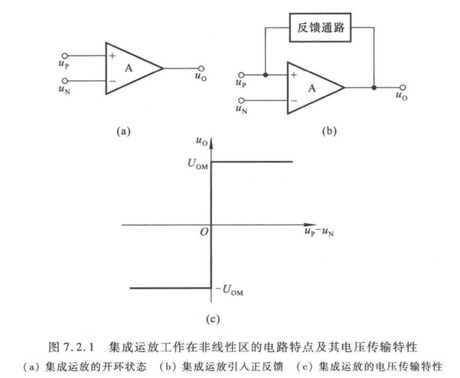

#### 种类

1. 单限比较器
2. 滞回比较器
3. 窗口比较器

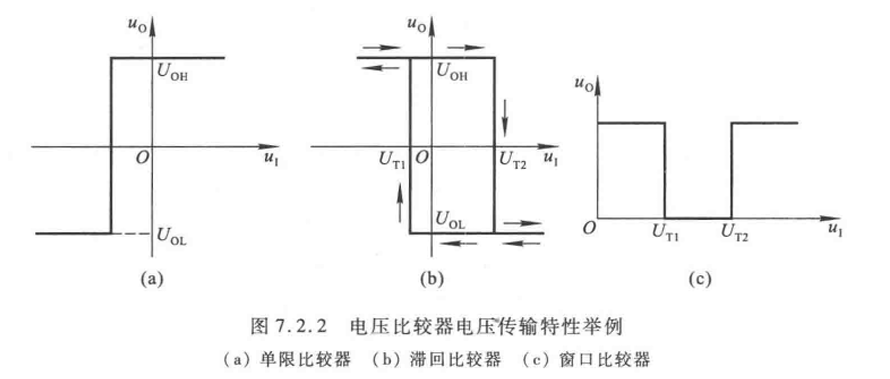


### 7.2.2 单限比较器

#### 过零比较器

仅供理解

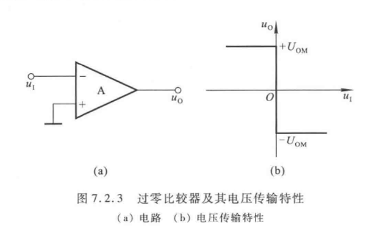

如果希望 $u_I>0$ 时输出高电平，将7.2.3（a）的反相输入端接地。

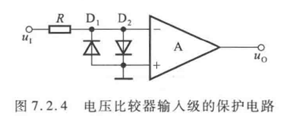

限制差模输入电压

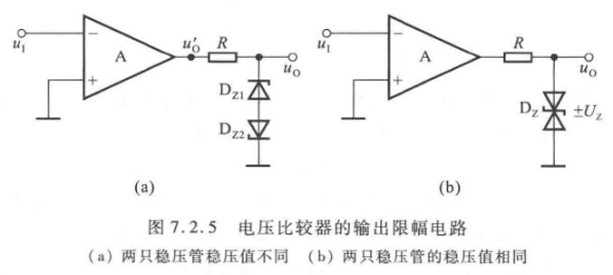

输出端稳压管限幅以获取合适的高/低电平

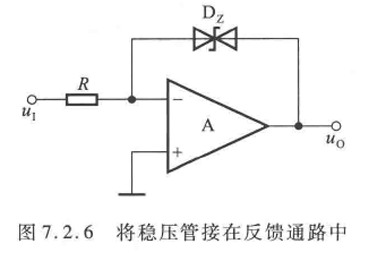

7.2.6 所示电路的分析：

1. 假设稳压管截止，则集成运放工作在开环状态，输出为 $\pm U_{om}$
2. 因此稳压管必定被击穿，工作在稳压状态
3. 负反馈通路，虚地， $u_O = \pm u_{Z}$

优点：

1. 几乎没有差模输入电压/电流（负反馈虚短虚断），保护了集成运放输入级
2. 集成运放没有在非线性区工作，过零时内部的三极管工作状态仍然稳定，因此提高了输出电压的变化速度

#### 一般单限比较器

重要一些

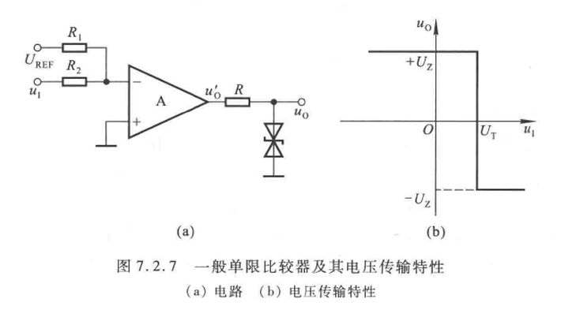

外加参考电压 $U_{REF}$，根据叠加定理：

$u_N = \frac{R_1}{R_1+R_2}u_I + \frac{R_2}{R_1+R_2}U_{REF}$

令 $u_N = u_P$ 求出 $\left.U_I\right|_{u_N = u_P} = U_T = -\frac{R_2}{R_1}U_{REF}$


### 7.2.3 滞回比较器

单限会让微小的干扰也使输出突变，滞回比较器具有“惯性”，因此抗干扰能力好

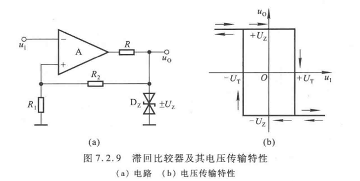

图7.2.9（a）中可以看出

1. 输出限幅， $u_O=\pm U_Z$
2. 反相输入端： $u_I$ 同相输入端： $\frac{R_1}{R_1+R_2}U_Z$
3. $U_T = \pm \frac{R_1}{R_1+R_2}U_Z$

为使得电压传输特性曲线发生平移，使得 $R_1$ 接地端接上 $U_{REF}$，仍然使用叠加定理求解


### 7.2.4 窗口比较器

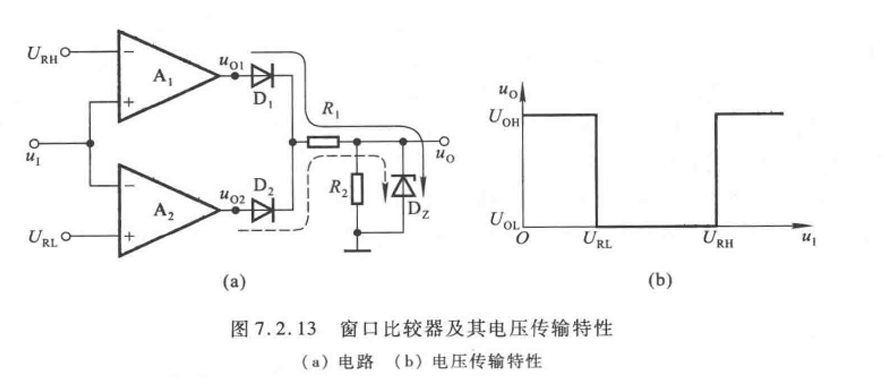

图中 $U_{RH}>U_{RL}$

如果 $u_I$ 小于 $U_{RH}, U_{RL}$，实线所示通路导通，如果 $u_I$ 小于 $U_{RL}, U_{RH}$，虚线所示通路导通，都会使得 $D_Z$ 击穿，输出为 $U_{OH}=U_Z$

$u_I$ 在二者之间，则都不导通，输出为 $U_{OL}=0$

## 7.3 非正弦波发生电路

### 7.3.1 矩形波

有了比较器和振荡电路就可以做矩形波

#### 原理

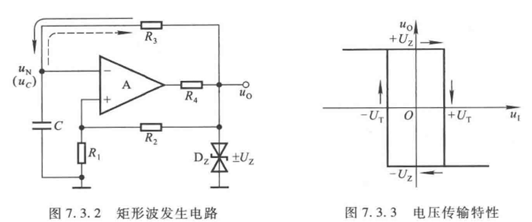

图7.3.2中滞回比较器的阈值电压 

$$\pm U_T = \pm \frac{R_1}{R_1+R_2}U_Z$$ 

其中 $u_I$ 为 $u_N$，也就是 $u_C$

$R_3C$ 组成RC振荡：

1. 假设一个 $+U_Z$ 的输出，则RC电路受到这个 $+U_Z$ 的作用而充电，电流如实线所示
2. 电容充电达到 $u_C = +U_T$，对应图7.3.3中右上半边矩形的传输特性
3. 由于传输特性的限制， $u_I=u_C>+U_T$ 时， $u_O$ 立即反转变为 $-U_Z$
4. RC电路开始反向**加速放电**，电流如虚线所示。可以参考图7.3.5（b）——半个周期内，最开始的时候是最陡峭的
5. 又抵达 $u_I = -U_T$，之后同理

对于 $u_C$ 从 $-U_T$ 到 $+U_T$ 的半个周期， $R_3C$ 一阶RC电路三要素法：

$$+U_T = (U_Z+U_T)(1-e^{-\frac{T/2}{R_3C}}) + (-U_T)$$

因此

$$T = 2R_3C\ln(1+\frac{2R_1}{R_2})$$

注意，这里要求先求解 $U_T$ 才能求解 $T$，但是题目简单也能直接套。

#### 占空比可调的矩形波


改变通路上的电阻，类似地列式得到：

$$T = T_1+T_2 \approx (R_w +2R_3)C\ln(1+\frac{2R_1}{R_2})$$

其中占空比 $q$：

$$q = \frac{T_1}{T} \approx \frac{R_{w1}+R_3}{R_w + 2R_3}$$

占空比是计算**高电平所占的比例**

#### 题型

要求掌握：方波

1. 求阈值电压
2. 求周期（套公式）
3. 求占空比
4. 画输出波形

要求掌握：三角波

1. 分析两个部分——滞回比较器和积分运算电路
2. 写出滞回比较器输出 $u_{o1}$ 和积分运算输出 $u_{o2}$ 的函数关系
   1. $u_{o1}(u_{o2})$
   2. $u_{o2}(u_{o1})$
3. 定性画波形

### 7.3.x 其他波形

基本不讲

#### 三角波


一个滞回比较器，一个积分运算电路

1. 写出滞回比较器输出 $u_{o1}$ 和积分运算输出 $u_{o2}$ 的函数关系
   1. $u_{o1}(u_{o2})$
   2. $u_{o2}(u_{o1})$
2. 定性画波形