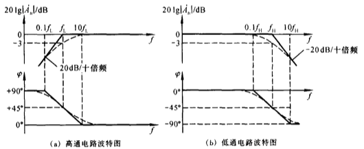
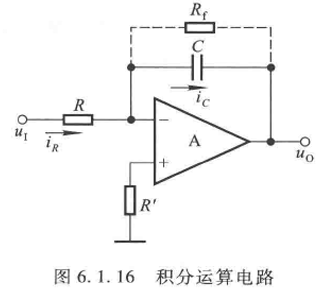
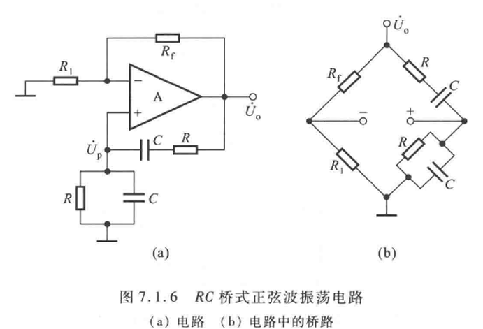
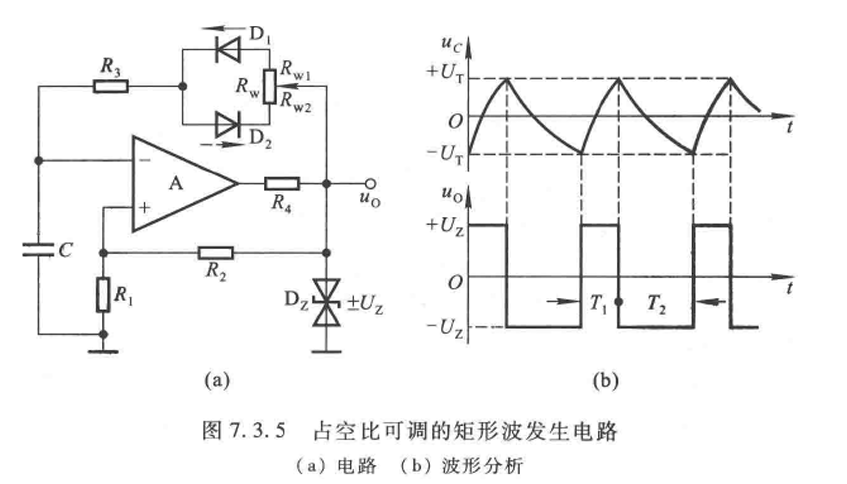
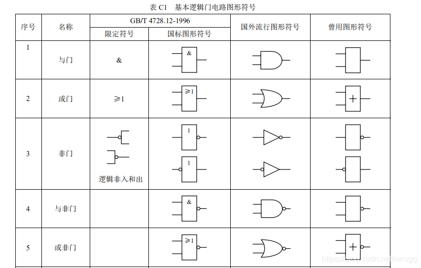

## 频率响应
### 高频、中频、低频的放大倍数

#### 表达式

对于高通和低通：

1.  **高通**的**下限频率**
   $$\dot A_{ufL} = \frac{1}{1+\frac{f_L}{jf}}$$
2.  **低通**的**上限频率**
   $$\dot A_{ufH} = \frac{1}{1+\frac{jf}{f_H}}$$

其中 $f_H, f_L$ 都是 

$$\frac{1}{2\pi\tau}=\frac{1}{2\pi RC}$$

记忆：

1. $\dot A_{uf} < 1$ 必然，分子是1，分母是1+比值
2. 比值中有一个高通/低通频率作为参考，只有在当前的频率 $f$ 与这个参考有可比性的时候才会使得 $\dot A_{uf}$ 明显地小于1
3. 高通意味着低频率时的 $\dot A_{uf}$ 不够接近1，而低通则意味着高频率时的 $\dot A_{uf}$ 不够接近1

#### 波特图

幅频特性：频率变化时放大倍数大小的变化。要素：

1. 坐标轴：纵坐标 $20\lg|A_u|/\mathrm{dB}$ （注意：**分贝**） 横坐标 $f$
2. 横坐标
   1. 下限上限 $f_L, f_H$ 对应了波特图的拐点，两拐点之间的中频 $|A_u|=|A_{um}|$
   2. 上下限两侧相差10倍频的两个横坐标—— $0.1f_L, 10f_L, 0.1f_H, 10f_H$
3. 从拐点开始的斜线——**斜率**为$\pm 20\mathrm{dB}/10$倍频
4. 虚线（可选）：波特图是线性化的，虚线是曲线，存在于拐点的两侧所划定的区域内，当取得拐点位置 $f=f_L, f_H$ 时，虚线上对应了 $20\lg|A_{uf}|=-3\mathrm{dB}$

相频特性：频率变化时放大倍数相位角的变化。要素：

1. 坐标轴：纵坐标 $\phi$ 横坐标 $f$
2. 横坐标上的要素同前
3. 当达到 $f=f_L, f_H$ 时，取得 $\pm 45^\circ$ 的相移，而 $\pm 90^\circ, 0^\circ$ 的相移是在 $0.1f_L, 10f_L, 0.1f_H, 10f_H$ 时取到的——也就是认为 $\phi=0$ 的中频段存在于 $10f_L\sim0.1f_H$ 之间
4. 正负：对于高通，给予 $f \to 0$，那么电容对于RC电路的阻抗影响最大，电路近似纯电容。对于电容，电流总是领先其两端电压 $90^\circ$，而输出电压取自电阻，电阻电压和电流同相，因此输出电压**领先**了输入 $90^\circ$。对于低通，输出取自电容电压，而电容电压总是**滞后** $90^\circ$，结论相反。

### 单管放大电路的频率响应

#### 简化pi模型

与之前的不同点在于：
1. 把 $r_{be}$ 分为有效的 $r_{b'e}$ 和串联在外部的 $r_{bb'}$
2. 增加了一个 **be** 极间的电容 $C_\pi'$，也就是**并联**在了 $r_{b'e}$ 两端
3. 相当于输入回路是一个低通电路（输出在 $r_{b'e}$）

#### 放大倍数的频率响应

[参见笔记ch5n-单管放大倍数的频率响应](../cls-ch5/ch5n.md#44-单管放大电路的频率响应)

1. 分级写出 $r_{b'e}$ 上放大倍数的表达式
2. 写出空载中频的放大倍数
3. 分析高频，输入回路是低通
4. 分析低频，输出回路（通常）是高通
5. 如果有多个高/低通相连， $f_L = 1.1\sqrt{\sum_{n=1}f_{Ln}^2}$， $f_H = 1.1\sqrt{\sum_{n=1}\frac{1}{f_{Hn}^2}}$
6. 最后
   $$\dot A_u = \dot A_{usm} \dot A_{ufl} \dot A_{ufh} = \frac{\dot A_{usm}}{(1+\frac{f_L}{jf})(1+\frac{jf}{f_H})}$$

## 反馈

### 定性判断

#### 基本判断

1. 判断有无
2. 判断极性 - 瞬时极性法
3. 判断直流交流

#### 负反馈类型的判断

[参见笔记ch5n-四种负反馈判断](../cls-ch5/ch5n.md#522-四种负反馈判断)

电压/电流反馈描述了放大电路的输出量是以什么形式输入反馈网络的。

1. 如果**反馈网络与负载并联**，反馈网络就会收到以**电压**形式存在的输出，因此我们将这种反馈称为**电压反馈**
2. 如果**反馈网络与负载串联**，反馈网络就会收到以**电流**形式存在的输出，因此我们将这种反馈称为**电流反馈**

串联/并联反馈描述了反馈网络的输出量是以什么形式反馈给放大电路的。

1. 如果反馈网络的输出端口**与放大电路的输入端口**直接连接在一起，就会将网络中的电流汇入输入作为反馈，能将**电流进行汇聚**的反馈，称为**并联反馈**
2. 如果反馈网络的输出端口连接到了**与放大电路的输入端口反相**的输入端口，就会将反馈网络的输出端口的电势作为反馈，**改变了两端口间电势**的反馈，称为**串联反馈**

### 定量计算

1. $\dot A = \frac{\dot X_o}{\dot X_i'}$ 基本放大电路放大倍数
2. $\dot F = \frac{\dot X_f}{\dot X_o}$ 反馈系数 - 由**输出**得到**反馈量** - 因为反馈方式的不同而有可能有不同的单位
3. $\dot A_f = \frac{\dot X_o}{\dot X_i}$ 反馈放大电路的放大倍数 - 由输入电压得到输出电压

要做题

### 深度负反馈、反馈网络的虚短虚断

一般表达式： $\dot A_f = \frac{\dot A}{1+\dot A \dot F}$

实质： $|1+\dot A\dot F| \gg 1$, 

$$\dot A_f \approx \frac 1 {\dot F}$$

[参见笔记ch5n-深度负反馈](../cls-ch5/ch5n.md#54-深度负反馈)

[参见笔记ch5n-反馈网络分析和虚短虚断](../cls-ch5/ch5n.md#反馈网络分析虚短虚断)

[深度负反馈相关计算-bilibili](https://www.bilibili.com/video/BV1aT4y1T7Dd)

[虚短虚断-bilibili](https://www.bilibili.com/video/BV12D4y1h7qz)

深度负反馈下，放大电路两输入端口的电流很小，因此两端口之间近似断路，而电势近似相等，两端口之间近似短路。

## 信号的运算和处理

会利用虚短虚断分析即可，具体例子参见[6.1基本运算电路](../cls-ch6/ch6n.md#61-基本运算电路)

需要注意的就是积分电路，分析方法多了一个对电容的积分分析。

$u_I=\frac{q}{C}=\frac{\int I\mathrm dt}{C}=\frac{\int u_I\mathrm dt}{RC}$

## 滤波电路

### 无源

对于一个RC，C输出的低通电路，如果C两端并联一个 $R_L$ 负载，那么：

$$\dot A_u = \frac{\dot A_{up}}{1+j\frac{f}{f'_p}}$$

$$f'_p = \frac{1}{2\pi(R\parallel R_L)C}$$

$f'_p$ 是指有负载时的截止频率， $f_p$ 是空载时的，然后就可以画波特图

### 有源

加上**电压跟随器**就可以防止负载影响滤波特性

## 波形发生和信号转换
### 正弦波振荡

正反馈，振幅增大直到 $\dot A \downarrow$ 并最后达到平衡：

$$\dot A \dot F = 1$$

### 选频：文氏电桥

使用文氏电桥选频并反馈，满足

$$\begin{cases}
    |\dot F|=3\\
    f_0=\frac{1}{2\pi RC}
\end{cases}$$

还能得知，稳定时：

$$|\dot A|=\frac{1}{3}$$

为了稳定电压幅值，在电路中引入非线性元件，以图7.1.6（a）为例：

1. 假设 $\dot U_o$ 因为某种原因增大，则要使得 $\dot A_u=\frac{u_o}{u_i}=1+\frac{R_f}{R_1}$ 减小
2. $\dot U_o \uparrow, P \uparrow, T\uparrow$
3. 因此可以通过使 $R_1$ 为正温度系数电阻或 $R_2$ 为负温度系数电阻实现

### 比较器

比较器的题就是要：
1. 求阈值电压 $U_T$ 
2. 找到高低电平 $U_{OH}, U_{OL}$
3. 画图

参见笔记 [ch7n-一般单限比较器](../cls-ch7/ch7n.md#一般单限比较器) 之后的部分 

### 矩形波和占空比

有了比较器和振荡电路就可以做矩形波

关键公式（得记）：

$$T = T_1+T_2 \approx (R_w +2R_3)C\ln(1+\frac{2R_1}{R_2})$$

对应高/低电平的 $T_1, T_2$ 则需要将前面的系数改作 $R_{wx}+R_3$, x = 1 or 2，取决于高/低电平时对应的通路所选择的电阻

高低电平切换时，电容加速放电，对应在 $u_C$ - $t$ 中，是指每“半个”周期中，最开始的时候斜率最大。

占空比：**高电平**在一个周期中所占的时间

## 数电

### 门的画法

首先，你得记国标画法，国标画法都是方块，中间是一个符号。

1. 与门 & 逻辑乘
2. 或门 $\geq 1$ 逻辑加
3. 非门 1 带一个圈
4. 与非和或非
5. 异或门 =1

再次解释异或：相当于在问：“AB真假**是否不同**？”

### 表达式化简

参见x.1.6运算法则

1. 交换律/结合律/分配律
2. $A+BC = (A+B)(A+C)$ 分配特例（重叠所导致的）
3. $A\bar A=0, A+\bar A = 1$ 互补
4. $AA=A, A+A=A$ 重叠
5. $\overline{(\bar A)} = A$ 反转
6. $A+AB=A, A(A+B)=A$ 吸收
7. $A+\bar A B = A+B$ 反吸收
8. $\overline{(AB)}=\bar A + \bar B, \overline{(A+B)}=\bar A \bar B$ 拆括号变号
9. $A \oplus B=(A\bar B+\bar AB)$ 异或定义

### 真值表

#### 从真值表推电路和逻辑计算式

1. 找到真值表里面所有输出为1的组合
2. 每个组合之间用逻辑加法（OR）连接
3. 这个组合对应的逻辑表达式为：
   1. 假设有3个输入 $A_1=0, A_2=1, A_3=0$
   2. 那么为0的取反，为1的不变，用逻辑乘法连接 $\bar A_1 A_2\bar A_3$
4. 得到的就是结果

### MOSFET组成的门电路

#### MOSFET

箭头反偏就导通

#### 识别基本功能结构

推导或者死记，参见x.3.2-3的内容