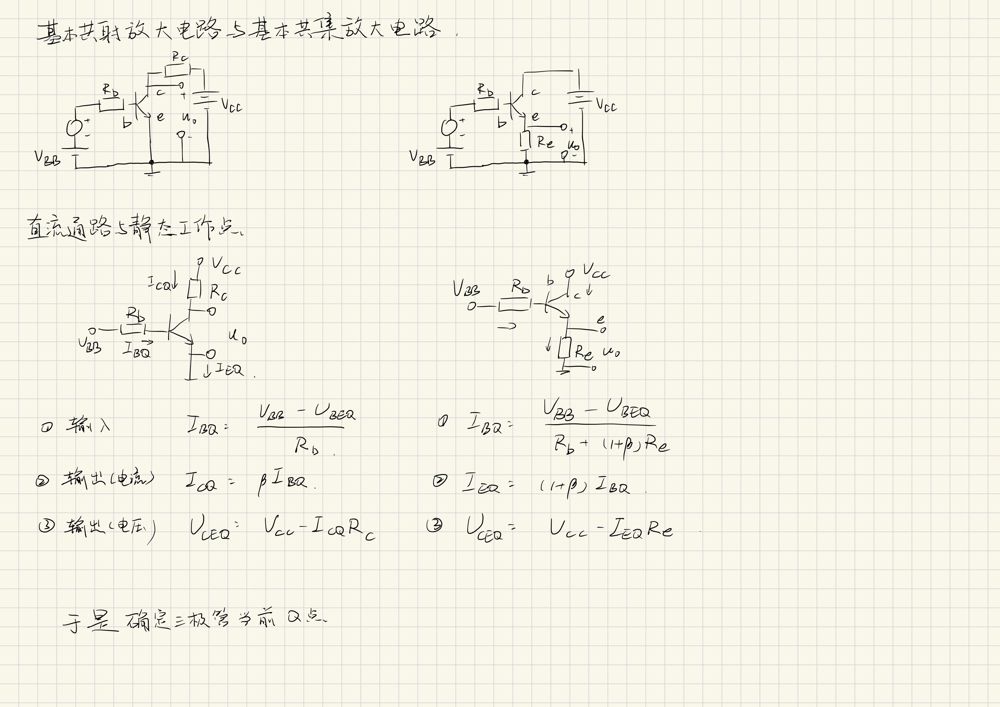
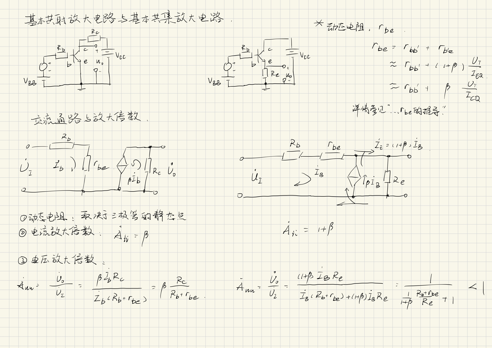
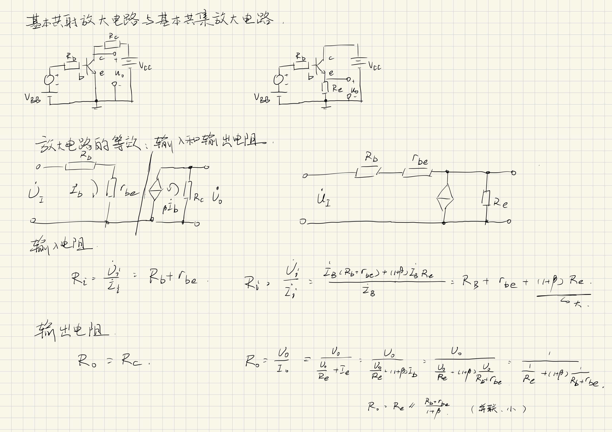

# 专题：三种基本放大电路

本文参考了https://blog.csdn.net/qq_40475568/article/details/88934774

## 基本共射放大电路

输入/输出：b/c

## 基本共集放大电路

输入/输出：b/e

以基本共集放大电路为例：

### 直流通路与静态工作点

对于直流通路，使用压降计算 $R_\mathrm{e}$ ：

$$I_\mathrm{BQ} = \frac{V_\mathrm{BB} - U_\mathrm{BEQ}}{R_\mathrm{b} + (1+\beta)R_\mathrm{e}} \tag{1}$$

不计发射结电阻， $(1+\beta)R_\mathrm{e}$ 项是由关系 $(1+\beta)I_\mathrm{b} = I_\mathrm{e}$ 得到的等效电阻。

经过放大：

$$I_\mathrm{EQ} = (1+\beta) I_\mathrm{BQ} \tag{2}$$

三极管ce之间的压降：

$$U_\mathrm{CEQ} = V_\mathrm{CC} - I_\mathrm{EQ}R_\mathrm{e} \tag{3}$$

经过上述三个表达式，得到直流工作点。

### 交流通路与放大倍数

## 基本共基放大电路

输入：e
输出：c

## 总结

共用极之外的极为输入和输出极，这种情况下的输入可以是b也可以是e

### $r_\mathrm{be}$ 的推导

$r_\mathrm{be}$ 包含两个部分

1. $r_\mathrm{bb'}$ 基区体电阻
   基极端子（b）到晶体管内部有效基区（b'）的体电阻。
2. $r_\mathrm{b'e}$ 发射结电阻**在基极输入端的反映**

PN结的伏安特性方程：

$$i_\mathrm{E} \approx I_\mathrm{EQ}(\mathrm{e}^\frac{u_\mathrm{BE}}{U_T} - 1)$$

对于交流小信号 $i_\mathrm{e}$ 所能引起的输出信号变化：

$$\left.\frac{\mathrm{d}i_\mathrm{E}}{\mathrm{d}u_\mathrm{BE}}\right|_{u_\mathrm{BE} = \mathrm{const.}} 
= \frac{I_\mathrm{EQ}\mathrm{e}^\frac{u_\mathrm{BE}}{U_T}}{U_T}
\approx \frac{i_\mathrm{E}}{U_T}$$

在静态工作点附近 $i_\mathrm E = I_\mathrm E + i_\mathrm e \approx I_\mathrm E$ ，因此发射结的动态电阻：

$$r_\mathrm{b'e} = \left.\frac{\mathrm{d}u_\mathrm{BE}}{\mathrm{d}i_\mathrm{E}}\right|_{u_\mathrm{BE} = \mathrm{const.}} = \frac{U_T}{I_\mathrm{EQ}}$$

由于发射结电阻相对更大，可以认为压降和压降的变化主要在发射结上发生。即 
$$\Delta u_\mathrm{BE} = \Delta u_\mathrm{BB'} + \Delta u_\mathrm{B'E} \approx \Delta u_\mathrm{B'E}$$

压降变化在发射结上的反映是：

$$\Delta i_\mathrm E 
= \left.\frac{\mathrm{d}i_\mathrm{E}}{\mathrm{d}u_\mathrm{BE}}\right|_\mathrm{Q} \Delta u_\mathrm{BE} 
= \frac{\Delta u_\mathrm{BE}}{r_\mathrm{b'e}}$$

$r_\mathrm{be}$ 去除基区体电阻的部分（忽略基区体电阻时）：

$$\begin{aligned}
r_\mathrm{be} 
&\approx \frac{\Delta u_\mathrm{BE}}{\Delta i_\mathrm{B}} \\
&\approx \frac{\Delta u_\mathrm{BE}}{\Delta i_\mathrm E/(1+\beta)} \\
&= (1+\beta) \frac{U_T}{I_\mathrm{EQ}}
\end{aligned}$$

这是电流放大效应下的等效发射结电阻。

加上 $r_\mathrm{bb'}$ 即得到 $r_\mathrm{be} = r_\mathrm{bb'} + (1+\beta)\frac{U_\mathrm{T}}{I_\mathrm{EQ}}$

其在大小上还可以等于 $r_\mathrm{bb'} + \frac{U_\mathrm{T}}{I_\mathrm{BQ}} = r_\mathrm{bb'} + \beta\frac{U_\mathrm{T}}{I_\mathrm{CQ}}$

直接相加的理由：

基极电流 $\Delta i_{B}$ 同时流经 $r_\mathrm{bb'}$ 和 $(1 + \beta)r_\mathrm{b'e}$:

$$\Delta u_\mathrm{BE} = \underbrace{\Delta i_\mathrm{B} \cdot r_\mathrm{bb'}}_{体电阻压降} + \underbrace{\Delta i_\mathrm{B} \cdot (1 + \beta)r_\mathrm{b'e}}_{反射结电阻压降}$$

根据欧姆定律，总电阻为:

$$r_\mathrm{be} = \frac{\Delta u_\mathrm{BE}}{\Delta i_\mathrm{B}} = r_\mathrm{bb'} + (1 + \beta)r_\mathrm{b'e}$$

二者直接相加，无耦合项。

得到的 $r_\mathrm{be}$ 适用于三极管，而非特定的放大电路。